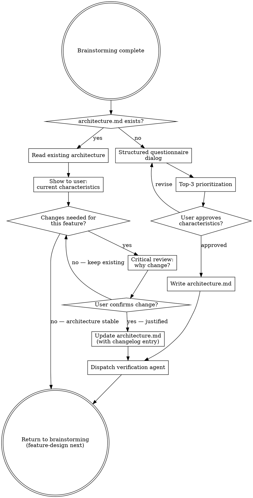

# Architecture Assessment

Identify, document, and maintain architecture characteristics through structured dialogue with the user. The architecture is a persistent, evolving artifact — not a one-time decision.

**Semantic anchors:** This skill applies ATAM (Architecture Tradeoff Analysis Method) for quality attribute analysis and tradeoff identification, arc42 for structured architecture documentation, Clean Architecture for testability and layer independence, Domain-Driven Design for bounded contexts and strategic design, and Definition of Done with architecture compliance gates.

**Announce at start:** "I'm using the architecture-assessment skill to identify architecture characteristics for this project."

## When to Use

- After brainstorming completes and before writing specs, feature files, or plans
- When a new project needs architecture characteristics identified
- When an existing project's characteristics need updating for a new feature
- When the user asks about quality attributes, architecture tradeoffs, or non-functional requirements

**When NOT to use:**
- If `architecture.md` already exists and is current — read it instead of re-running the full assessment
- For individual architecture decisions — use `superflowers:architecture-decisions` instead

## The Iron Law

```
NO SPEC WITHOUT ARCHITECTURE CHARACTERISTICS
```

You cannot make design decisions without knowing which quality attributes matter. Define them first.

<HARD-GATE>
Do NOT proceed to writing specs, feature-design, or writing-plans until
architecture characteristics are documented in architecture.md and the
user has approved them. This applies to EVERY project regardless of
perceived simplicity.
</HARD-GATE>

## Process Flow



## The Persistent Architecture File

**Path:** `architecture.md` in the project root.

This file evolves over time. It is NOT recreated for each feature — it is updated incrementally.

- **File exists:** Read it, show current characteristics to the user, critically assess whether changes are needed
- **File does not exist:** Create it through the structured questionnaire dialog
- **After changes:** Dispatch a fresh verification agent to check consistency (see `superflowers:architecture-reviewer agent (agents/architecture-reviewer.md)`)

### architecture.md Format

```markdown
# Architecture Characteristics

## Last Updated: YYYY-MM-DD

## Top 3 Priority Characteristics
1. [Characteristic] — [Concrete metric/goal]
2. [Characteristic] — [Concrete metric/goal]
3. [Characteristic] — [Concrete metric/goal]

## All Characteristics

### Operational
| Characteristic | Priority | Concrete Goal | Fitness Function | Cadence |
|---------------|----------|---------------|-----------------|---------|
| Performance | Critical | API <200ms p95 | Yes - load test | Holistic (PR) |
| Availability | Important | 99.9% uptime | Yes - health check | Nightly |

### Structural
| Characteristic | Priority | Concrete Goal | Fitness Function | Cadence |
|---------------|----------|---------------|-----------------|---------|
| Modularity | Critical | No circular deps | Yes - dependency check | Atomic (commit) |
| Testability | Important | >80% coverage | Yes - coverage gate | Atomic (commit) |

### Cross-Cutting
| Characteristic | Priority | Concrete Goal | Fitness Function | Cadence |
|---------------|----------|---------------|-----------------|---------|
| Security | Critical | No known CVEs | Yes - vulnerability scan | Atomic (commit) |

**Cadence values:** Atomic (every commit/CI run), Holistic (per PR, may need running services), Nightly (long-running, scheduled).

**Splitting compound characteristics:** If a characteristic has multiple distinct sub-goals (e.g., Security covering both "no CVEs" and "no SQL injection" and "input validation"), split them into separate rows. Each row should have one concrete, independently testable goal. This makes fitness function creation straightforward — one row, one automated check.

## Architecture Drivers
- [Driver]: [Why it matters, which characteristic it influences]

## Architecture Decisions
- [Decision]: [Rationale, which characteristic it addresses]

## Changelog
- YYYY-MM-DD: Initial architecture assessment
```

## Context Map Awareness

If `context-map.md` exists (from superflowers:bounded-context-design), read it before starting the questionnaire. Bounded contexts inform the assessment:

- **Modularity/Coupling:** How many contexts? How tightly coupled are their relationships? (Partnership = tight, Separate Ways = loose)
- **Interoperability:** Do contexts use different technologies or data formats? (Published Language = yes)
- **Scalability:** Do different contexts have different scaling needs? (e.g., Catalog handles 10x more reads than Fulfillment)
- **Per-context characteristics:** Some characteristics may be critical for one context but irrelevant for another. Note these differences — they inform architecture-style-selection about whether to treat contexts differently.

If no `context-map.md` exists, proceed with the questionnaire as normal.

## Constraint Awareness

If a feature constraints file exists in `docs/superflowers/constraints/` (from superflowers:constraint-selection), read the most recent one before the questionnaire. Active constraints inform the assessment:

- **Security constraints** (encryption, authentication) → elevate Security characteristic priority
- **Compliance constraints** (audit logging, data retention) → may introduce Compliance as a characteristic
- **Technology constraints** (specific frameworks, databases) → inform Deployability and Interoperability
- **Process constraints** (four-eyes, change management) → inform Testability and Deployability

Present the active constraints to the user during the questionnaire: "These organizational constraints are active for this feature and may affect architecture characteristics."

If no constraints file exists, proceed normally.

## The Questionnaire Dialog (New Projects)

**If `market-analysis.md` exists:** Use the competitive landscape to inform quality attribute prioritization. If the market analysis identifies performance or scalability as differentiators, weight those characteristics higher in the questionnaire.

Walk the user through each category. Ask one question at a time. Use the full questionnaire from `questionnaire-template.md`.

### Phase 1: Operational Characteristics

For each characteristic, ask:
1. **Relevance:** "How important is [X] for this system?" (critical / important / nice-to-have / irrelevant)
2. **Concreteness** (if critical/important): "What does [X] mean concretely? For example: response time <200ms, 99.9% uptime, 1000 concurrent users"
3. **Fitness Function:** "Should we automate a check for this?" (yes/no)

Characteristics to assess:
- **Availability** — How much downtime is acceptable?
- **Performance** — What are the latency/throughput requirements?
- **Scalability** — How many users/requests must the system handle? Growth expectations?
- **Reliability** — What happens when things fail? Recovery requirements?
- **Fault Tolerance** — Must the system continue operating during partial failures?

### Phase 2: Structural Characteristics

- **Modularity** — How important is clean separation of concerns?
- **Extensibility** — How often will new features be added? By whom?
- **Testability** — What level of automated testing is required?
- **Deployability** — How often will the system be deployed? Blue/green? Rolling?
- **Coupling** — Are there integration points with external systems?

### Phase 3: Cross-Cutting Characteristics

- **Security** — What data is handled? Authentication/authorization requirements?
- **Compliance** — Regulatory requirements (GDPR, HIPAA, SOC2)?
- **Accessibility** — WCAG requirements?
- **Usability** — Who are the users? Technical sophistication?
- **Observability** — Logging, monitoring, tracing requirements?

### Phase 4: Top-3 Prioritization

After collecting all characteristics, present the critical/important ones and ask:

> "Every architecture characteristic adds complexity. Which are your TOP 3 — the ones that should drive architecture decisions above all others?"

**Uncertainty handling:** If you are unsure about prioritization (e.g., two characteristics seem equally important, or a characteristic could go either way), follow the Uncertainty Handling Pattern in `references/uncertainty-handling.md`: name the uncertainty, present 2-3 options with tradeoffs, and use AskUserQuestion with structured choices. Do NOT present an uncertain recommendation as settled and ask "Passt das?".

The top 3 become the primary architecture drivers.

## Critical Update Mode (Existing Projects)

When `architecture.md` already exists, be SKEPTICAL about changes:

1. Show the user the current top 3 characteristics
2. Ask: "Does this new feature change our architecture requirements?"
3. If the user wants changes:
   - Ask: "Why does this change the architecture? What is different now?"
   - Challenge: "Could we achieve this within the current architecture constraints?"
   - If truly justified: Update with changelog entry and invoke `superflowers:architecture-decisions` to create an ADR documenting why the characteristics changed
   - If not justified: Recommend keeping the existing architecture

**Architecture should be stable.** Frequent changes to architecture characteristics are a red flag — either the initial assessment was incomplete or requirements are being confused with architecture.

## Red Flags — STOP

- Changing top-3 characteristics for every new feature (architecture is not feature-specific)
- Adding characteristics without removing or deprioritizing others (complexity budget)
- Vague goals like "good performance" without concrete metrics
- Skipping the questionnaire because "we already know what we need"
- Treating every requirement as a new architecture characteristic

## Rationalization Prevention

| Excuse | Reality |
|--------|---------|
| "Architecture doesn't change for this feature" | Review it anyway. 2 minutes to confirm stability. |
| "We need to completely restructure" | Architecture evolves incrementally. Justify each change with concrete evidence. |
| "Performance isn't important yet" | Performance is an architecture characteristic, not an afterthought. Retrofitting is 10x harder. |
| "We'll figure out the architecture later" | Later = technical debt. Every design decision is an architecture decision. |
| "This is just a prototype" | Prototypes become products. Define characteristics now, even if minimal. |
| "The architecture is obvious" | Obvious to you. Document it so the implementing agent shares your understanding. |

## Verification

After writing or updating architecture.md, dispatch a fresh agent using `superflowers:architecture-reviewer agent (agents/architecture-reviewer.md)` to verify:
1. All characteristics have concrete, measurable goals
2. Top 3 are clearly identified and justified
3. No contradictions between characteristics
4. Fitness function column is populated for critical characteristics
5. Changelog reflects the change accurately

## Reference Files

- `../architecture-style-selection/references/architecture-characteristics-reference.md` — Canonical definitions for all architecture characteristics from the Ford/Richards Architecture Characteristics Worksheet. Use these definitions when walking the user through the questionnaire.

## Integration

**Called after:** superflowers:bounded-context-design (domain boundaries inform characteristics)
**Reads:** `context-map.md` if it exists (from bounded-context-design)
**Runs before:** superflowers:architecture-style-selection (style selection needs characteristics)
**Then:** superflowers:feature-design (architecture informs scenarios)
**During implementation:** superflowers:fitness-functions verifies compliance
**Pairs with:** superflowers:feature-design (BDD for behavior, fitness functions for architecture)
