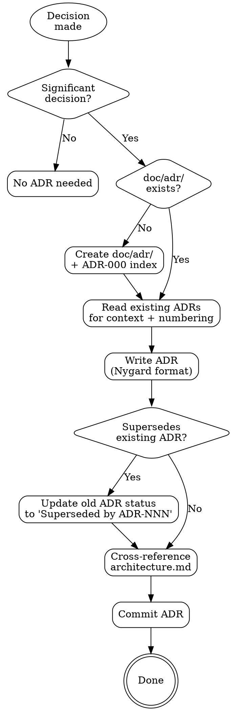

# Architecture Decisions

> "If a decision is worth making, it's worth recording." — Michael Nygard

Document architecture decisions as lightweight, immutable records. ADRs capture the WHY behind decisions — the context, alternatives considered, and consequences accepted. Six months from now, when someone asks "why did we choose X?", the ADR has the answer.

**Semantic anchors:** ADR (Architecture Decision Records) following Nygard's format, arc42 Section 9 (Architecture Decisions), ATAM tradeoff documentation.

**Announce at start:** "I'll document this architecture decision as an ADR."

## When to Use

- During brainstorming when an approach is chosen
- During architecture-assessment when characteristics are prioritized
- During architecture-style-selection when a style is selected
- During implementation when an unplanned structural change is made
- When the user asks "why did we decide X?" or wants to document a decision

**When NOT to use:**
- For easily reversible choices (library version, variable naming)
- When there's only one viable option (no real decision was made)
- For coding conventions — use a style guide instead

## The Iron Law

```
EVERY SIGNIFICANT ARCHITECTURE DECISION GETS AN ADR
```

If you chose between alternatives and the choice affects the system's structure, quality attributes, or development approach — write an ADR. The cost of writing one is 2 minutes. The cost of not having one is hours of archaeology later.

## What Counts as an Architecture Decision

Not every technical choice needs an ADR. Use this filter:

**Write an ADR when:**
- Choosing between architectural approaches (REST vs GraphQL, monolith vs microservices)
- Selecting a technology that's hard to reverse (database, message broker, framework)
- Prioritizing quality characteristics (performance over simplicity)
- Accepting a tradeoff (eventual consistency for scalability)
- Making an unplanned structural change during implementation

**Skip an ADR when:**
- The choice is easily reversible (library version, variable naming)
- There's only one viable option (no real decision was made)
- It's a coding convention, not an architecture decision (use a style guide instead)

## ADR Format

Follow Nygard's lightweight format. Every ADR fits in one screen — if it's longer, you're over-explaining.

```markdown
# ADR-NNN: [Title — what was decided, in imperative form]

## Status
[Proposed | Accepted | Deprecated | Superseded by ADR-XXX]

## Context
[What is the issue? What forces are at play — technical, organizational, business?
 What alternatives were considered? Keep it factual, not argumentative.]

## Decision
[What we decided and why. One or two sentences. Be specific.]

## Consequences
[What becomes easier? What becomes harder? What new constraints do we accept?
 Both positive and negative — honest assessment, not a sales pitch.]
```

**Title convention:** Use imperative form — "Use Service-Based architecture", not "We decided to use Service-Based architecture" or "Service-Based Architecture Decision".

## Process Flow



## Step 1: Check for Existing ADRs

Check if `doc/adr/` exists in the project. If not, create it with an index file:

```markdown
# Architecture Decision Records

This directory contains Architecture Decision Records (ADRs) for this project.
ADRs document significant architecture decisions following Michael Nygard's format.

## Current Architecture at a Glance

_Derived from active (Accepted) ADRs. Updated automatically._

| Aspect | Decision | ADR |
|--------|----------|-----|

## Index

| ADR | Title | Status | Date |
|-----|-------|--------|------|
```

The **"Current Architecture at a Glance"** block is the project's architectural truth at a glance. It is derived exclusively from ADRs with status "Accepted" — superseded and deprecated ADRs are excluded. This block is updated every time an ADR is written or superseded. Other skills (especially brainstorming) read this block to understand the current architectural constraints before designing new features.

Read existing ADRs to understand:
- The next sequential number (ADR-001, ADR-002, ...)
- What decisions have already been made (avoid contradictions)
- Whether this new decision supersedes an existing one

## Step 2: Write the ADR

Create `doc/adr/ADR-NNN-title-in-kebab-case.md` following the Nygard format.

**Context section tips:**
- State the problem, not the solution
- List the alternatives that were considered (at least 2)
- Include relevant data: scores from style-selection matrix, cost estimates, team constraints
- Reference architecture.md characteristics when they drove the decision

**Decision section tips:**
- One clear statement: "We will use [X]"
- Brief rationale: "because [Y]"
- Don't repeat the context — just the choice and its core justification

**Consequences section tips:**
- Start with what gets EASIER (positive consequences)
- Then what gets HARDER (negative consequences / tradeoffs accepted)
- Be honest — if you accepted a tradeoff, say so
- Reference specific quality scenarios or fitness functions affected

## Step 3: Handle Superseding

If this decision replaces a previous one:
1. Write the new ADR with status "Accepted"
2. Add to the Context: "This supersedes ADR-NNN because [reason for change]"
3. Update the old ADR's status to: "Superseded by ADR-NNN"
4. Do NOT modify the old ADR's Context, Decision, or Consequences — only the Status line changes
5. Update the "Current Architecture at a Glance" block — remove the superseded ADR's entry, add the new one
6. **Trigger the Superseding Cascade** (see below)

ADRs are immutable records. Changing the old one's content would rewrite history. The new ADR explains why the world changed.

### Superseding Cascade

When an ADR is superseded, downstream artifacts may be affected. The cascade depends on what kind of decision changed:

| Superseded Decision | Cascade |
|---|---|
| Architecture Style (e.g., Service-Based → Microservices) | Re-run architecture-style-selection in "Re-Selection" mode: remove old style FFs from architecture.md, generate new ones. Re-evaluate quality-scenarios for affected scenarios. |
| Driving Characteristics (e.g., new Top-3) | Re-run architecture-assessment in "Update" mode. May trigger style re-evaluation. Re-evaluate quality-scenarios. |
| Technology Choice (e.g., SQLite → PostgreSQL) | Update architecture.md if affected. Check quality-scenarios for affected test specifications. |
| Approach/Pattern (e.g., REST → GraphQL) | Check writing-plans for affected tasks. Check feature-design for affected scenarios. |

**Traceability is the key:** Every fitness function in architecture.md has an ADR reference column. When an ADR is superseded, all FFs referencing that ADR are identified and replaced by the superseding ADR's FFs. This is NOT a violation of FF immutability — it's a legitimized architecture change with a documented ADR as evidence.

## Step 4: Cross-Reference and Update Index

After writing the ADR:

1. **Update the ADR index** (`doc/adr/` index file) with the new entry
2. **Update "Current Architecture at a Glance"** — rebuild from all Accepted ADRs
3. **Add reference in `architecture.md`** if it exists:

```markdown
## Architecture Decisions
- ADR-001: [Title] — [which characteristic/fitness function this relates to]
- ADR-002: [Title] — [which characteristic/fitness function this relates to]
```

4. **Add ADR reference to fitness functions** — if this ADR justifies specific FFs, add the ADR number to the FF table:

```markdown
| Fitness Function | What it checks | Tool/Approach | ADR |
|---|---|---|---|
| No shared database | Each service owns its DB | DB config analysis | ADR-001 |
```

## Step 5: Commit

Commit the ADR (and any updated files) to git with a message like:
```
Add ADR-003: Use event-driven architecture for sensor ingestion
```

## When ADRs Are Created During Other Skills

ADRs naturally emerge from decisions made in other skills. Here's when to create them:

| Skill | Decision Point | ADR Title Pattern |
|-------|---------------|-------------------|
| brainstorming | User chooses approach A over B | "Use [approach] for [component]" |
| architecture-assessment | Top-3 characteristics prioritized | "Prioritize [char1], [char2], [char3] as driving characteristics" |
| architecture-style-selection | Style selected | "Use [style] architecture" |
| quality-scenarios | Tradeoff resolved | "Accept [tradeoff] to achieve [goal]" |
| implementation | Unplanned technical decision | "Introduce [technology] for [reason]" |

The calling skill doesn't need to create the ADR itself — it invokes this skill when a decision is made. The ADR skill handles the format, numbering, cross-referencing, and commit.

## Red Flags — STOP

- **ADR without alternatives:** If you didn't consider alternatives, you didn't make a decision — you made an assumption. Go back and think about what else you could have done.
- **ADR with no consequences:** Every decision has consequences. If you can't think of any downsides, you haven't thought hard enough.
- **Modifying accepted ADRs:** Only the Status line changes. Everything else is immutable. Create a new ADR if the decision changes.
- **ADR for every tiny choice:** Not every variable name or library version needs an ADR. Use the filter above.
- **ADR as justification document:** An ADR records a decision, not argues for it. Keep it factual and balanced.

## Rationalization Prevention

| Excuse | Reality |
|--------|---------|
| "The decision is obvious" | Obvious to you, now. In 6 months, nobody will remember why. 2 minutes to write, hours saved later. |
| "We can always change it" | Some decisions are expensive to reverse. The ADR documents what you knew at the time. |
| "We'll document it later" | Later = never. Write it while the context is fresh. |
| "The code speaks for itself" | Code shows WHAT, not WHY. ADRs fill the gap. |
| "Too many ADRs will be noisy" | A healthy project has 10-30 ADRs. If you have hundreds, your filter is too loose. |

## Step 6: Independent Verification

After committing the ADR, dispatch the `superflowers:architecture-decision-reviewer` agent for independent verification.

Follow the Review-Loop Pattern from `agents/reviewer-protocol.md`:
1. Dispatch architecture-decision-reviewer (fresh context)
2. If ISSUES_FOUND: fix the cited issues, then re-dispatch reviewer (fresh)
3. Repeat until reviewer returns APPROVED
4. Only then proceed

<HARD-GATE>
Do NOT present the ADR to the user or proceed to downstream skills
until the architecture-decision-reviewer returns APPROVED.
If ISSUES_FOUND: fix and re-dispatch. Do NOT ask the user whether to fix.
</HARD-GATE>

## The Bottom Line

Every significant architecture decision gets an ADR. Undocumented decisions are invisible decisions.

## Integration

- **Invoked by:** Any skill that makes an architecture decision (brainstorming, architecture-assessment, architecture-style-selection, quality-scenarios, implementation)
- **Produces:** ADR files in `doc/adr/`
- **Verified by:** `architecture-decision-reviewer` (consistency, cascade, traceability)
- **Referenced by:** `superflowers:writing-plans` (implementation plan references relevant ADRs)
- **Pairs with:** `superflowers:architecture-assessment` (ADRs document WHY characteristics were chosen)
- **Pairs with:** `superflowers:architecture-style-selection` (ADR documents style selection rationale)
