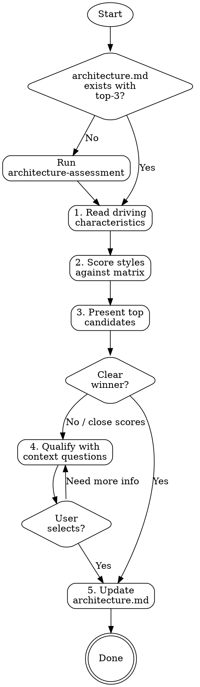

# Architecture Style Selection

> "There are no wrong answers in architecture, only expensive ones." — Mark Richards

Based on the Architecture Styles Worksheet V2.0 by Mark Richards (DeveloperToArchitect.com) and
"Fundamentals of Software Architecture" by Neal Ford & Mark Richards.

**Announce when invoked:** "I'll now help select the best architecture style for your project based on the driving characteristics we identified."

## The Iron Law

```
NO ARCHITECTURE STYLE WITHOUT DRIVING CHARACTERISTICS.
```

The style selection is driven by the top-3 architecture characteristics identified during architecture-assessment. Without knowing what matters most, any style choice is arbitrary. If `architecture.md` doesn't exist or has no prioritized characteristics, run `superflowers:architecture-assessment` first.

## Process Flow



## Step 1: Read Driving Characteristics

Read `architecture.md` from the project root. Extract:
- The **Top 3 Priority Characteristics** (these drive the selection)
- All other identified characteristics (these serve as tiebreakers)
- Any architecture drivers or constraints already documented

If architecture.md uses the older operational/structural/cross-cutting categories, that's fine — map the characteristics to the names in the matrix. See `references/architecture-characteristics-reference.md` for the canonical definitions.

## Step 2: Score Styles Against the Matrix

Read `references/architecture-styles-matrix.md` for the complete rating matrix.

For each architecture style, calculate a **fit score**:

1. **Look up the star rating** for each of the top-3 characteristics
2. If the characteristic isn't directly in the matrix, use the mapping table in the matrix reference to find the closest proxy
3. **Sum the ratings** for the top-3 characteristics — this is the style's fit score (max 15)
4. **Note the cost** — expensive styles need justification

Present the results as a ranked table:

```
## Architecture Style Fit Analysis

Top 3 Driving Characteristics: [char1], [char2], [char3]

| Rank | Style | [char1] | [char2] | [char3] | Fit Score | Cost |
|------|-------|---------|---------|---------|-----------|------|
| 1    | ...   | ★★★★★   | ★★★★    | ★★★★★   | 14/15     | $$   |
| 2    | ...   | ★★★★★   | ★★★★★   | ★★★     | 13/15     | $$$$ |
| ...  |       |         |         |         |           |      |
```

Sort by fit score descending. Highlight the top 2-3 candidates.

## Step 3: Present Candidates with Tradeoff Analysis

For the top 2-3 candidates, present a tradeoff analysis. This is not just about the fit score — it's about understanding what you gain and what you give up.

For each candidate:
- **Strengths**: Which driving characteristics does this style excel at?
- **Weaknesses**: Where does this style score poorly? Are any of these characteristics also important (even if not top-3)?
- **Cost implication**: Is the cost proportional to the benefit?
- **Partitioning type**: Technical vs domain — does this align with the team's mental model?

If one style clearly dominates (fit score 3+ points ahead AND lower cost), recommend it directly.
If scores are close (within 2 points), proceed to Step 4.

## Step 4: Qualify with Context Questions

When scores are close or cost tradeoffs are significant, ask qualifying questions to break the tie. Only ask what's needed — don't interrogate.

**Team & Organization:**
- How large is the team? (Small teams struggle with distributed architectures)
- How many teams will work on this system? (Multiple teams benefit from service boundaries)
- What's the team's experience with distributed systems?

**Constraints:**
- Are there deployment constraints? (Cloud-native vs on-premise, containerization available?)
- Is there an existing system being replaced or extended?
- Budget constraints? ($$$$$ styles need strong justification)

**Growth & Change:**
- How quickly do requirements change? (High change rate favors evolvable styles)
- What's the expected growth trajectory? (10x growth needs scalable styles)
- Is this a product or a project? (Products favor microkernel/extensible styles)

Use the answers to adjust the recommendation. For example:
- Small team + microservices score high → warn about operational overhead, suggest service-based as a stepping stone
- Tight budget + space-based scores high → may be cost-prohibitive despite technical fit
- Single team + modular monolith scores well → good fit, can evolve toward services later

## Step 5: Update architecture.md

After the user confirms a selection, update `architecture.md` with a new section:

```markdown
## Selected Architecture Style

**Style:** [Selected Style]
**Partitioning:** [technical/domain]
**Cost Category:** [$-$$$$$]

### Selection Rationale
- Driving characteristics: [char1] (★N), [char2] (★N), [char3] (★N)
- Fit score: [X]/15
- [Key reason for this choice over alternatives]
- [Any qualifying context that influenced the decision]

### Tradeoffs Accepted
- [Characteristic]: Rated [N]/5 — [how this will be mitigated]
- [Characteristic]: Rated [N]/5 — [acceptable because...]

### Evolution Path
- [If applicable: how this architecture can evolve as needs change]
- [e.g., "Start with service-based, extract to microservices as team grows"]

### Architecture Style Fitness Functions
These fitness functions enforce the selected style's structural invariants. They are mandatory and immutable — if the implementation violates them, the implementation must change, not the fitness function.

| Fitness Function | What it checks | Tool/Approach |
|---|---|---|
| [copied from style-fitness-functions.md for the selected style] | ... | ... |
```

## Step 6: Generate Style Fitness Functions

After updating architecture.md with the selected style, read `references/style-fitness-functions.md` and copy the fitness functions for the selected style into the `### Architecture Style Fitness Functions` section of architecture.md.

These fitness functions serve a different purpose than the characteristic-based fitness functions from architecture-assessment:
- **Characteristic fitness functions** verify quality attributes (e.g., "API response < 200ms", ">80% test coverage")
- **Style fitness functions** enforce structural invariants (e.g., "no shared database between services", "no circular module dependencies")

Both types are mandatory. Together they ensure the system not only meets its quality goals but is actually built in the chosen architectural style.

The fitness-functions skill picks up BOTH types from architecture.md during implementation. The verification-before-completion skill checks that ALL pass before any completion claim.

If an evolution path is defined (e.g., Phase 1: Service-Based → Phase 3: selective Microservices), only the current phase's style fitness functions apply. When the team moves to the next phase, the new phase's fitness functions are added — the old ones are NOT removed unless the style explicitly replaces them.

## Red Flags — STOP

- **Selecting without characteristics**: Never pick a style because it's trendy or because "everyone uses microservices." The characteristics drive the decision.
- **Ignoring cost**: A style with a perfect fit score but $$$$$ cost needs explicit budget justification. Suggest cheaper alternatives that score almost as well.
- **Resume-driven architecture**: If the team wants microservices but the characteristics point to modular monolith, present the data. The matrix doesn't lie.
- **Premature distribution**: If simplicity is a driving characteristic AND the system is new, distributed architectures (microservices, event-driven, space-based) should be questioned even if they score well on other characteristics.

## Rationalization Prevention

| Excuse | Reality |
|--------|---------|
| "We'll need microservices eventually" | Start with the simplest style that fits. Evolve when the pain is real, not predicted. |
| "Our cloud provider makes it easy" | Cloud tooling reduces operational burden but doesn't eliminate architectural complexity. |
| "Monoliths don't scale" | Modular monoliths scale vertically quite far. Service-based scales horizontally at moderate cost. |
| "Event-driven is always better for performance" | Event-driven adds latency through async processing. It excels at responsiveness and elasticity, not raw throughput. |
| "SOA worked at my last company" | Service-oriented architecture adds governance overhead. Unless you need enterprise-scale integration, simpler styles exist. |

## Verification Checklist

Before finalizing the architecture style selection:

- [ ] architecture.md exists with top-3 prioritized characteristics
- [ ] All 8 styles were scored against the driving characteristics
- [ ] Top candidates include tradeoff analysis (strengths, weaknesses, cost)
- [ ] If scores were close, qualifying context questions were asked
- [ ] User explicitly confirmed the selection
- [ ] architecture.md updated with style, rationale, tradeoffs, and evolution path
- [ ] Architecture style fitness functions copied from reference into architecture.md
- [ ] Cost is justified relative to the benefit

## Integration

- **Called after:** `superflowers:architecture-assessment` (characteristics must exist)
- **Runs before:** `superflowers:feature-design` (scenarios depend on architecture decisions)
- **Pairs with:** `superflowers:fitness-functions` (fitness functions verify architecture compliance)
- **Referenced by:** `superflowers:writing-plans` (implementation plan respects architecture style)

## Reference Files

- `references/architecture-styles-matrix.md` — Complete star-rating matrix for all 8 styles, characteristic mapping table, and instructions for adding new styles
- `references/architecture-characteristics-reference.md` — Canonical definitions for all architecture characteristics (common, implicit, composite, related pairs). Shared with architecture-assessment.
- `references/style-fitness-functions.md` — Fitness function templates per architecture style. Read this in Step 6 to populate architecture.md with style-specific fitness functions.
