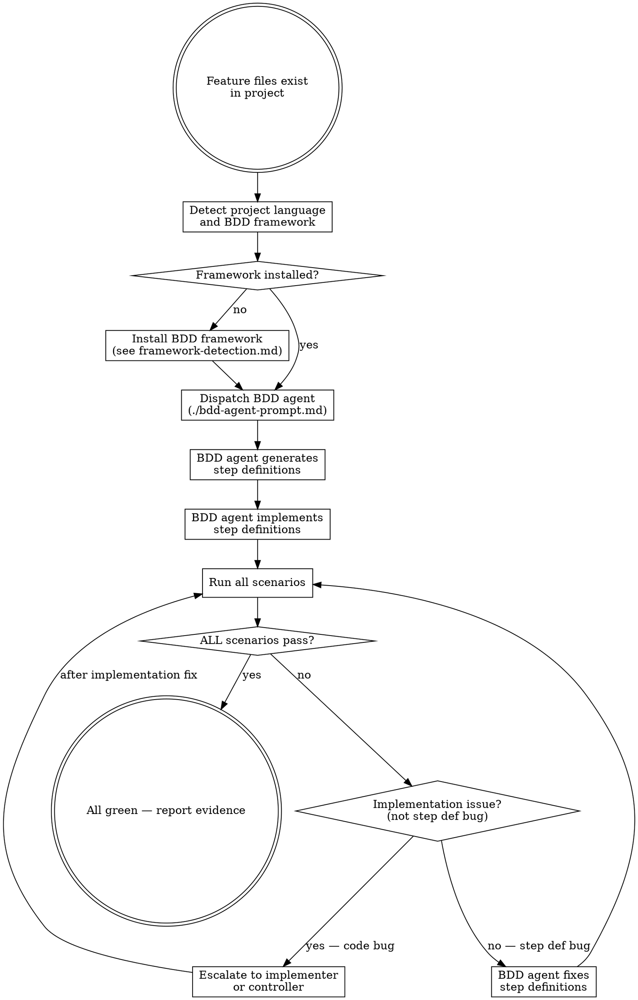

# BDD Testing

Convert .feature files into executable step definitions and test code. Every Gherkin scenario must have a passing automated test before work is complete.

**Semantic anchors:** This skill applies BDD (Behavior-Driven Development) Given-When-Then execution, Gherkin scenario parsing and step matching, Clean Architecture outside-in testing approach, Definition of Done with scenario-based quality gates, and Five Whys root cause analysis for failing scenarios.

**Announce at start:** "I'm using the bdd-testing skill to create and run executable BDD tests from the feature files."

## The Iron Law

```
NO COMPLETION CLAIM WITHOUT ALL SCENARIOS PASSING
```

Feature file exists but scenarios don't pass? Work is not done. Partial passage is failure.

<HARD-GATE>
Do NOT claim implementation is complete, create PRs, or invoke
finishing-a-development-branch until ALL .feature scenarios pass
with green automated tests. No exceptions.
</HARD-GATE>

## When to Use

- During implementation: when .feature files exist and tasks reference BDD scenarios
- At verification: before claiming any feature is complete
- When superflowers:subagent-driven-development or superflowers:executing-plans encounters tasks with .feature references

**When NOT to use:**
- No .feature files exist (use superflowers:feature-design first)
- Unit-only tests without corresponding feature files (use TDD directly)

## Process Flow



## Framework Detection

Auto-detect project language and select the appropriate BDD framework:

| Language | Detection | Framework | Run Command |
|----------|-----------|-----------|-------------|
| JavaScript/TypeScript | `package.json` | `@cucumber/cucumber` | `npx cucumber-js` |
| Python | `pyproject.toml` / `setup.py` / `*.py` | `behave` | `behave` |
| Python (pytest) | `pytest` already in use | `pytest-bdd` | `pytest --bdd` |
| Java/Kotlin | `pom.xml` / `build.gradle` | `cucumber-jvm` | `mvn test` / `gradle test` |
| Go | `go.mod` | `godog` | `godog` or `go test` |
| Ruby | `Gemfile` | `cucumber-ruby` | `bundle exec cucumber` |
| C#/.NET | `*.csproj` | `Reqnroll` | `dotnet test` |
| Rust | `Cargo.toml` | `cucumber-rs` | `cargo test --test features` |

For full detection heuristics, configuration templates, and setup instructions per framework, see `framework-detection.md`.

**If existing BDD config is found** (e.g., `cucumber.js`, `behave.ini`): use existing framework, don't override.

**If language cannot be detected:** Report NEEDS_CONTEXT and ask the controller.

## The BDD Agent

Dispatch a dedicated BDD subagent using `./bdd-agent-prompt.md`.

The BDD agent's primary role is **verification**, not creation. Step definitions are created during implementation (as plan tasks by the implementer). The BDD agent:
1. Reads all .feature files in the project
2. Detects project language (see `framework-detection.md`)
3. Installs BDD framework if not present
4. Runs dry-run to verify ALL steps have definitions (created by implementer during plan tasks)
5. If undefined steps are found: reports them as BLOCKED — implementer must create them first
6. Runs all scenarios, reports results
7. Fixes step definition bugs (wrong assertions, missing state setup) — but does NOT write new step definitions from scratch
8. Escalates implementation bugs to controller (not the agent's job to fix app code)
9. Reports: which scenarios pass, which fail, full test output

**Step definitions are created by the implementer as plan tasks (see writing-plans BDD Step Definition Task template). The BDD agent verifies they exist and work correctly.**

**Model selection:** Use a standard model for the BDD agent. Step definition writing is pattern-matching on Gherkin syntax — doesn't require the most capable model.

## When to Dispatch the BDD Agent

### During Implementation (per task)

After each implementation task completes and passes spec + quality review in subagent-driven-development, dispatch the BDD agent to verify relevant scenarios pass.

Only run scenarios tagged for the current task, not the full suite (save full suite for final gate).

### At Verification (final gate)

Before invoking finishing-a-development-branch, dispatch the BDD agent to run ALL scenarios as a comprehensive verification. This is the final gate.

## Mandatory Code Verification

Verification is NOT a checklist the agent self-reports. It is verified by RUNNING CODE.

### Step 1: Coverage Check — Every Feature File Has Step Definitions

Run the BDD framework in dry-run/validation mode to detect undefined steps:

```bash
# cucumber-js
npx cucumber-js --dry-run 2>&1 | grep -E "undefined|pending"

# behave
behave --dry-run 2>&1 | grep -E "undefined|not implemented"

# godog
godog --no-colors 2>&1 | grep "undefined"
```

**If ANY undefined or pending steps exist: STOP. Implementation is NOT complete.**
The agent MUST implement the missing step definitions before proceeding.

### Step 2: Full Test Run — Every Scenario Passes

Run the complete BDD suite and capture the exit code:

```bash
# cucumber-js
npx cucumber-js --format progress 2>&1; echo "EXIT_CODE=$?"

# behave
behave 2>&1; echo "EXIT_CODE=$?"
```

**If exit code is not 0: STOP. Implementation is NOT complete.**
Parse the output to identify which scenarios failed and why.

### Step 3: Regression Check — Previously Passing Scenarios Still Pass

Compare current results against last known good run. If any previously passing scenario now fails, this is a regression — the implementation broke existing behavior.

### Step 4: Step Definition Quality Check

After tests pass, READ the step definition files and check for quality issues:

1. **Hardcoded values:** Steps that return hardcoded results instead of calling real code (e.g., `context.response = 200` instead of making an actual HTTP call). These make tests meaningless — they prove nothing about the implementation.
2. **Mock-like behavior:** Steps that simulate behavior instead of exercising real code paths. If a Given step sets up fake state that the When step never actually processes, the test is a tautology.
3. **Missing delegation:** Steps that contain business logic instead of calling application code. Step definitions are glue — they should call functions, not implement them.
4. **Unused setup:** Given steps that set variables never used by When/Then steps.

**If quality issues are found:** Report them with specific file and line references. These are NOT test failures but quality warnings that should be fixed before the implementation is considered complete.

**All 4 steps must succeed. No exceptions. No "looks good to me". Only code output counts as evidence.**

## Step Definition Best Practices

- **Thin step definitions:** Parse Gherkin parameters, delegate to real code. Steps are glue, not logic.
- **No business logic in steps.** Steps call application code, they don't replicate it.
- **No hardcoded returns.** Steps must exercise real code, not return fixed values.
- **Use intermediaries:** Page objects (UI), API clients (HTTP), domain helpers (logic).
- **Cucumber expressions over regex** when the framework supports it.
- **World/context object** for sharing state between steps within a scenario.
- **No globals.** Each scenario starts with clean state.

## Debugging Failing Scenarios

When scenarios fail, apply Five Whys root cause analysis:

1. **Why did the scenario fail?** → Step X threw an error
2. **Why did Step X throw?** → Expected value Y but got Z
3. **Why was the value wrong?** → Function F returns incorrect result
4. **Why does F return incorrectly?** → Missing edge case handling
5. **Why was the edge case missed?** → Requirement was in the spec but not in unit tests

Distinguish between:
- **Step definition bug:** The test code is wrong → BDD agent fixes it
- **Implementation bug:** The application code is wrong → Escalate to implementer
- **Scenario bug:** The scenario itself is wrong → Escalate to user (scenarios are the spec)

## Immutability of Tests

<HARD-GATE>
During verification, existing BDD tests are IMMUTABLE:
- Do NOT modify .feature files to make tests pass
- Do NOT modify existing step definitions to weaken assertions
- Do NOT delete scenarios or step definitions
- Do NOT skip or ignore failing scenarios

If a scenario fails, the IMPLEMENTATION must be fixed — not the test.
The only exception: the user explicitly requests a scenario change because
the requirement itself changed. This requires user approval, not agent judgment.
</HARD-GATE>

**Conflict Resolution Protocol:**
If implementation reveals that a new feature conflicts with existing scenarios:
1. **STOP implementation immediately**
2. Report the conflict: "Implementing [X] requires changing existing scenario [Y] in [file]"
3. Show the current scenario and what would need to change
4. Ask the user to decide:
   a) Update the existing scenario (user must approve the specific change)
   b) Redesign the new feature to not conflict
   c) Create a separate scenario that supersedes the old one
5. Only proceed after explicit user decision

**If the user approves a feature file change (option a), trigger the Change Impact Cascade:**
1. Update the .feature file as approved
2. Run `npx cucumber-js --dry-run` to identify all broken/undefined step definitions
3. Update affected step definitions to match the new scenario text
4. Run the full BDD suite — ALL scenarios must pass (changed + unchanged)
5. If unchanged scenarios now fail: the implementation has a regression — fix the code, not the tests

Step definitions for changed scenarios MUST be updated in the same commit as the feature file change. Never leave a gap where .feature files and step definitions are out of sync.

This protocol applies to ALL phases: step definition creation, implementation, verification.
Feature files are NEVER silently modified — every change requires explicit user approval with documented reasoning.

## Red Flags — STOP

- Step definitions containing business logic (too coupled)
- Scenarios that pass without exercising real code (mocked away entirely)
- "Most scenarios pass" treated as complete (ALL must pass)
- Skipping BDD agent because "unit tests cover it" (different concern)
- .feature files modified to match implementation (scenarios are the spec, not tests)
- Step definitions that duplicate application logic instead of calling it
- Existing step definitions weakened to make failing tests pass
- Agent modifying .feature files to match implementation (MOST CRITICAL violation)
- Changing Given/When/Then steps in existing scenarios without user approval
- "Fixing" scenarios that fail by adjusting the scenario instead of the code
- Scenarios deleted or commented out to reduce failure count

## Rationalization Prevention

| Excuse | Reality |
|--------|---------|
| "Unit tests already cover this" | Unit tests verify units. BDD verifies behavior from user perspective. Different levels. |
| "Most scenarios pass, close enough" | Partial = incomplete. Would you ship with 80% of unit tests passing? |
| "Setting up BDD framework is overhead" | One-time cost. BDD agent handles setup automatically. |
| "Scenarios are wrong, not the code" | Scenarios are the spec. If the spec is wrong, fix it with the user, don't silently adjust. |
| "I'll just adjust this assertion" | Tests are immutable during verification. Fix the code, not the test. |
| "This scenario is outdated" | Only the user decides that. Escalate, don't delete. |
| "BDD is redundant with integration tests" | BDD scenarios are stakeholder-readable. Integration tests aren't. |
| "I'll run BDD tests later" | Later = never. Run them now. |
| "Step definitions are not needed yet" | Undefined steps = untested features. If the .feature file exists, the steps must exist too. |
| "The dry-run passed so we're good" | Dry-run only checks step existence. Full run checks behavior. Both are required. |
| "I verified the tests manually" | Manual verification is not verification. Run the command. Show the output. |
| "Tests pass so the step definitions are fine" | Passing tests with hardcoded values prove nothing. Read the step definitions and check quality. |
| "The step definitions are just glue code, quality doesn't matter" | Bad glue makes tests meaningless. A test that returns hardcoded 200 is not testing anything. |

## Verification Checklist (Code-Verified, Not Self-Reported)

Every item below MUST be verified by running a command and checking its output.
"I checked and it looks fine" is NOT verification. Show the command and its output.

- [ ] BDD framework installed: `npx cucumber-js --version` (or equivalent) returns version number
- [ ] Dry-run shows ZERO undefined/pending steps: `npx cucumber-js --dry-run` output contains no "undefined" or "pending"
- [ ] Full test run passes: `npx cucumber-js` exits with code 0
- [ ] Scenario count matches feature file count: output shows N scenarios, N passed (no skipped)
- [ ] No .feature files were modified: `git diff -- '*.feature'` shows no changes
- [ ] No existing step definitions were weakened: `git diff -- '*steps*'` shows only additions, no modified assertions
- [ ] Regression check: all previously passing scenarios still pass
- [ ] Step definition quality: no hardcoded values, no mock-like behavior, steps delegate to real code
- [ ] Full test run output pasted as evidence in the verification report

## Integration

**Requires:** .feature files from superflowers:feature-design
**Used by:** superflowers:subagent-driven-development (additional agent type after task completion)
**Used by:** superflowers:verification-before-completion (required evidence)
**Pairs with:** superflowers:test-driven-development (complementary, not replacement — TDD for units, BDD for behavior)
