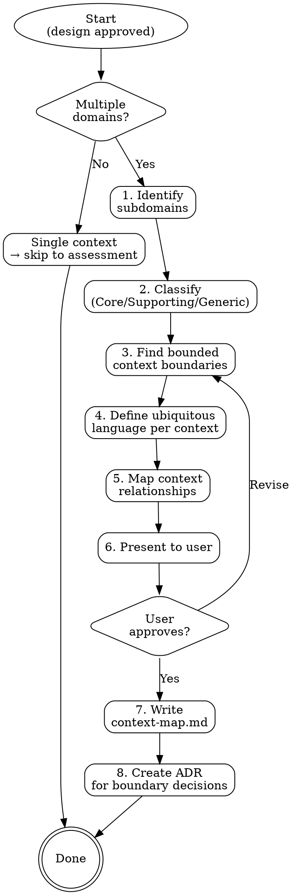

# Bounded Context Design

> "The bounded context is the central pattern in Domain-Driven Design." — Eric Evans

Identify where domain boundaries are before deciding how to build the system. A bounded context defines where a particular model applies and where it stops. Without clear boundaries, you build accidental monoliths with tangled domains — where changing "Order" in checkout breaks "Order" in fulfillment because they're the same class but mean different things.

**Semantic anchors:** Domain-Driven Design (Eric Evans), Strategic Design, Context Mapping (Vaughn Vernon), Bounded Context, Ubiquitous Language.

**Announce at start:** "I'll help identify the bounded contexts in your domain — where the boundaries are, how contexts relate to each other, and what language each context speaks."

## The Iron Law

```
KNOW YOUR DOMAIN BOUNDARIES BEFORE CHOOSING YOUR ARCHITECTURE
```

Architecture decisions (monolith vs microservices, module boundaries, team ownership) depend on domain boundaries. If you partition by technical layers instead of domain contexts, you get distributed monoliths — the worst of both worlds.

## When to Use — and When Not

**Use this skill when:**
- The system involves multiple business domains (e-commerce: catalog + checkout + fulfillment)
- Multiple teams will work on the system
- You're decomposing a monolith into services
- The user asks about service boundaries or module structure
- Different parts of the system use the same terms with different meanings

**Skip this skill when:**
- The system is a single, focused tool (one domain, one team, one purpose)
- The project is a library or utility, not a business application
- The domain is already well-understood and boundaries are obvious from the spec

Not every system needs multiple bounded contexts. A small internal HR tool is likely one context. Forcing DDD strategic patterns onto a simple CRUD app adds complexity without value. When in doubt, ask: "Does this system have multiple subdomains with different business rules?" If no — skip.

## Process Flow



## Step 1: Identify Subdomains

Read the brainstorming output (design doc) and identify the distinct business areas. A subdomain is a coherent area of business capability — not a technical layer.

Ask the user: "What are the main business areas in this system? For example, in e-commerce that might be: product catalog, ordering, payment, shipping, customer management."

**Heuristics for finding subdomains:**
- Different business rules → different subdomain
- Different stakeholders or domain experts → different subdomain
- Different rate of change → likely different subdomain
- Could be outsourced or bought as SaaS → likely a subdomain boundary

## Step 2: Classify Subdomains

**If `market-analysis.md` exists:** Use the Core/Supporting/Generic classification and differentiation strategy from there as primary input. The market analysis identifies where competitive advantage lies — that determines what's Core vs. Generic.

For each subdomain, classify:

| Type | Definition | Investment Level | Example |
|---|---|---|---|
| **Core Domain** | Where competitive advantage lives. This is what makes the business unique. | Highest — build in-house, best developers, most attention | E-commerce: recommendation engine, pricing algorithm |
| **Supporting Domain** | Necessary for the business but not differentiating. Custom-built because no off-the-shelf solution fits. | Moderate — build in-house but with less investment | E-commerce: inventory management, order fulfillment |
| **Generic Domain** | Solved problems. Every business needs this, nothing unique about your version. | Lowest — buy/outsource/use SaaS | Auth, payment processing, email sending, file storage |

Present the classification to the user:

```markdown
| Subdomain | Type | Rationale |
|---|---|---|
| Product Catalog | Core | Unique product taxonomy and search relevance drive conversions |
| Checkout | Core | Custom checkout flow is a competitive differentiator |
| Fulfillment | Supporting | Standard logistics, but custom warehouse integration needed |
| User Auth | Generic | Standard OAuth/OIDC, use an identity provider |
| Payment | Generic | Use Stripe/Adyen, no custom payment processing |
```

This classification matters because it drives architecture investment: Core domains get the best architecture, Generic domains get the simplest.

## Step 3: Find Bounded Context Boundaries

A bounded context is NOT the same as a subdomain — though they often align. A bounded context defines where a specific model is valid. The same real-world concept can mean different things in different contexts.

**The linguistic test:** If the same word means different things in different parts of the system, that's a context boundary.
- "Order" in Checkout = items + payment intent + shipping address
- "Order" in Fulfillment = pick list + shipping label + tracking number
- "Order" in Billing = invoice line items + payment status

**The team test:** If different teams own different parts, those are likely different contexts.

**The change test:** If two areas change for different reasons and at different rates, they're likely different contexts.

Walk the user through each subdomain and ask:
- "Does [concept X] mean the same thing everywhere in this subdomain, or does it have different facets in different areas?"
- "Would one team own all of this, or would it naturally split across teams?"
- "When [area A] changes, does [area B] need to change too?"

## Step 4: Define Ubiquitous Language

For each bounded context, define the key terms and what they mean IN THAT CONTEXT. This is the ubiquitous language — the shared vocabulary between developers and domain experts within one context.

```markdown
### Checkout Context — Ubiquitous Language

| Term | Meaning in this context |
|---|---|
| Order | A collection of items a customer intends to purchase, with payment and shipping details |
| Cart | A mutable, pre-order collection of items. Becomes an Order on checkout |
| Item | A product variant with quantity and price at time of adding to cart |
| Customer | The person making the purchase (name, email, shipping address) |
```

The ubiquitous language feeds directly into feature-design: Gherkin scenarios should use these exact terms, not technical jargon.

## Step 5: Map Context Relationships

For each pair of contexts that interact, define the relationship pattern. Read `references/context-map-patterns.md` for detailed descriptions of each pattern.

| Pattern | Upstream/Downstream | When to Use |
|---|---|---|
| **Partnership** | Symmetric | Two contexts evolving together, teams coordinate closely |
| **Shared Kernel** | Symmetric | Small shared model, both teams agree on changes |
| **Customer-Supplier** | Upstream supplies, downstream consumes | Clear provider/consumer, upstream accommodates downstream needs |
| **Conformist** | Upstream dictates | Downstream has no influence on upstream model |
| **Anti-Corruption Layer** | Downstream protects itself | Translate external/legacy models to keep your domain clean |
| **Open Host Service** | Upstream exposes API | Well-defined public API for multiple consumers |
| **Published Language** | Standard format | Shared interchange format (JSON Schema, Protobuf, events) |
| **Separate Ways** | No integration | Contexts are independent, no data flow between them |

**For legacy systems:** Default to Anti-Corruption Layer. Protect new bounded contexts from the legacy model by translating at the boundary. Never let legacy data models leak into new domain code.

## Step 6: Present to User

Show the complete context map:
1. List of bounded contexts with their subdomain classification
2. Ubiquitous language per context
3. Relationship map between contexts
4. Recommended boundary decisions (where to split, where to keep together)

**Uncertainty handling:** If a boundary placement is ambiguous (e.g., a concept could belong to either context), follow `references/uncertainty-handling.md`: present the options with tradeoffs and let the user decide. Do NOT default to one boundary and ask "Passt das?".

Wait for user confirmation before writing.

## Step 7: Write context-map.md

Persist to `context-map.md` in the project root.

### context-map.md Format

```markdown
# Context Map

## Last Updated: YYYY-MM-DD

## Subdomains

| Subdomain | Type | Bounded Context(s) |
|---|---|---|
| [Name] | Core/Supporting/Generic | [Context name(s)] |

## Bounded Contexts

### [Context Name]
- **Subdomain:** [Core/Supporting/Generic]
- **Responsibility:** [What this context does, in one sentence]
- **Team:** [Which team owns this, if known]
- **Ubiquitous Language:**
  | Term | Meaning |
  |---|---|
  | ... | ... |

## Context Relationships

| Upstream | Downstream | Pattern | Notes |
|---|---|---|---|
| Catalog | Checkout | Customer-Supplier | Catalog provides product data, checkout consumes |
| Checkout | Fulfillment | Published Language | Order events as JSON schema |
| Legacy System | [New Context] | Anti-Corruption Layer | Translate legacy models at boundary |

## Relationship Diagram

[Text-based diagram showing contexts and their relationships]
```

## Step 8: Create ADR for Significant Boundary Decisions

If boundary decisions were non-obvious (e.g., "we decided to keep Billing and Checkout in one context" or "we split User into Auth and Profile"), invoke `superflowers:architecture-decisions` to document the decision. Not every boundary needs an ADR — only the ones where alternatives were considered and a conscious choice was made.

## Red Flags — STOP

- **Technical boundaries instead of domain boundaries:** "Frontend Context" and "Backend Context" are NOT bounded contexts. Contexts are about business domains, not technical layers.
- **One context per entity:** "Order Context", "Product Context", "User Context" — this is entity-driven decomposition, not DDD. A context groups related business capabilities, not individual data entities.
- **Too many contexts for a small system:** A 2-person team building an internal tool probably has 1-2 contexts, not 8. More contexts = more integration complexity.
- **Ignoring existing team structure:** Conway's Law is real. If the org has 3 teams, aim for ~3 contexts. Fighting the org chart usually loses.
- **Skipping ubiquitous language:** If you can't define the key terms per context, you haven't understood the domain well enough.

## Rationalization Prevention

| Excuse | Reality |
|--------|---------|
| "We can figure out boundaries later" | Later = distributed monolith. Boundaries are cheaper to define now than to refactor later. |
| "Everything is connected, we can't split" | Everything is connected in any business. The question is: where are the MINIMAL integration points? |
| "We need one database for consistency" | Bounded contexts can share a database initially. Context boundaries are logical, not physical. |
| "DDD is overkill for our project" | If you have multiple domains, you have bounded contexts — whether you name them or not. Making them explicit prevents accidental coupling. |
| "Our domain is too simple for this" | If a single context is the right answer, this skill tells you that in Step 0. It takes 2 minutes to confirm. |

## Verification Checklist

- [ ] Subdomains identified and classified (Core/Supporting/Generic)
- [ ] Each bounded context has a clear responsibility (one sentence)
- [ ] Ubiquitous language defined per context (key terms with meanings)
- [ ] No technical boundaries masquerading as domain boundaries
- [ ] Context relationships mapped with explicit patterns
- [ ] Anti-Corruption Layer specified for legacy/external integrations
- [ ] Context count is proportional to system complexity (not inflated)
- [ ] User reviewed and approved the context map
- [ ] context-map.md written to project root
- [ ] Significant boundary decisions documented as ADRs

## Integration

- **Called after:** `superflowers:brainstorming` (needs the design to identify domains)
- **Runs before:** `superflowers:architecture-assessment` (domain boundaries inform characteristics)
- **Informs:** `superflowers:architecture-style-selection` (contexts = potential service/module boundaries)
- **Informs:** `superflowers:feature-design` (ubiquitous language for Gherkin scenarios)
- **Referenced by:** `superflowers:writing-plans` (module/service decomposition follows context boundaries)
- **Pairs with:** `superflowers:architecture-decisions` (boundary decisions become ADRs)

## Reference Files

- `references/context-map-patterns.md` — Detailed description of each context map relationship pattern with examples and when to use each one
