# Brainstorming Ideas Into Designs

Help turn ideas into fully formed designs and specs through natural collaborative dialogue.

Start by understanding the current project context, then ask questions one at a time to refine the idea. Once you understand what you're building, present the design and get user approval.

<HARD-GATE>
Do NOT invoke any implementation skill, write any code, scaffold any project, or take any implementation action until you have presented a design and the user has approved it. This applies to EVERY project regardless of perceived simplicity.
</HARD-GATE>

## Anti-Pattern: "This Is Too Simple To Need A Design"

Every project goes through this process. A todo list, a single-function utility, a config change — all of them. "Simple" projects are where unexamined assumptions cause the most wasted work. The design can be short (a few sentences for truly simple projects), but you MUST present it and get approval.

## Checklist

You MUST create a task for each of these items and complete them in order:

1. **Explore project context** — check files, docs, recent commits
2. **Domain understanding** — invoke superflowers:domain-understanding to build a domain profile. Analyzes code, asks domain questions, researches externally, incorporates user-provided knowledge sources (Confluence, Wiki, ontologies). Ensures design questions are domain-informed.
3. **Offer visual companion** (if topic will involve visual questions) — this is its own message, not combined with a clarifying question. See the Visual Companion section below.
4. **Ask clarifying questions** — one at a time, understand purpose/constraints/success criteria. Questions are informed by the domain profile from step 2.
5. **Propose 2-3 approaches** — with trade-offs and your recommendation
6. **Present design** — in sections scaled to their complexity, get user approval after each section
6b. **Post-design review** — follow `references/post-skill-review.md`: dispatch adr-decision-agent to scan dialog for ADR-worthy decisions (steps 4-6). Agent writes ADRs autonomously. Then dispatch spec-reviewer with new ADR context. Standard review-loop if issues found.
6c. **UX design check** — if the feature has user-facing UI, ask: "This feature has a user interface. Shall I run the UX design process (personas, task flows, wireframes) before we continue with architecture?" If yes: invoke `superflowers:ux-design`. UX results feed into feature-design (Step 12) and writing-plans (Step 17). If no or not applicable (backend-only, CLI, API): skip.
7. **Constraint selection** — invoke superflowers:constraint-selection to select organizational constraints relevant to this feature. Constraints inform architecture and spec. Skips automatically if no constraint repo is configured.
8. **Bounded context design** — invoke superflowers:bounded-context-design to identify domain boundaries, classify subdomains, create context map. Builds on the domain profile from step 2. Skips automatically for single-domain projects.
9. **Architecture assessment** — invoke superflowers:architecture-assessment to identify/review architecture characteristics. Architecture informs the spec.
10. **Architecture style selection** — invoke superflowers:architecture-style-selection to select best-fitting architecture style based on driving characteristics and generate style fitness functions. Updates architecture.md.
11. **Quality scenarios** — invoke superflowers:quality-scenarios to create testable quality scenarios from architecture characteristics, categorized by test type.
12. **Write feature files** — invoke superflowers:feature-design to create BDD acceptance criteria as Gherkin scenarios. Scenarios inform the spec.
13. **Write design doc** — save to `docs/superflowers/specs/YYYY-MM-DD-<topic>-design.md` and commit. Spec references architecture.md, quality-scenarios.md, .feature files, and active constraints.
14. **Spec self-review** — check for placeholders, contradictions, ambiguity, scope, architecture alignment, scenario coverage, constraint coverage (see below)
15. **User reviews written spec** — ask user to review the spec file before proceeding
16. **Create worktree** — invoke superflowers:using-git-worktrees to create an isolated workspace for implementation
17. **Transition to implementation** — invoke writing-plans skill to create implementation plan

## Process Flow

```dot
digraph brainstorming {
    "Read ADR index\n(Current Architecture at a Glance)" [shape=box];
    "ADRs exist?" [shape=diamond];
    "Present constraints\nfrom active ADRs" [shape=box];
    "Explore project context" [shape=box];

    "Read ADR index\n(Current Architecture at a Glance)" -> "ADRs exist?";
    "ADRs exist?" -> "Present constraints\nfrom active ADRs" [label="yes"];
    "ADRs exist?" -> "Explore project context" [label="no"];
    "Present constraints\nfrom active ADRs" -> "Explore project context";
    "Visual questions ahead?" [shape=diamond];
    "Offer Visual Companion\n(own message, no other content)" [shape=box];
    "Ask clarifying questions" [shape=box];
    "Propose 2-3 approaches" [shape=box];
    "Present design sections" [shape=box];
    "User approves design?" [shape=diamond];
    "Write design doc" [shape=box];
    "Spec self-review\n(fix inline)" [shape=box];
    "User reviews spec?" [shape=diamond];
    "Invoke writing-plans skill" [shape=doublecircle];

    "Explore project context" -> "Visual questions ahead?";
    "Visual questions ahead?" -> "Offer Visual Companion\n(own message, no other content)" [label="yes"];
    "Visual questions ahead?" -> "Ask clarifying questions" [label="no"];
    "Offer Visual Companion\n(own message, no other content)" -> "Ask clarifying questions";
    "Ask clarifying questions" -> "Propose 2-3 approaches";
    "Propose 2-3 approaches" -> "Present design sections";
    "Present design sections" -> "User approves design?";
    "User approves design?" -> "Present design sections" [label="no, revise"];
    "Invoke architecture-assessment" [shape=doublecircle];
    "Invoke feature-design" [shape=doublecircle];

    "Post-design review\n(ADR + artifact review)" [shape=box];
    "User approves design?" -> "Post-design review\n(ADR + artifact review)" [label="yes"];
    "Feature has UI?" [shape=diamond];
    "Invoke ux-design" [shape=doublecircle, style=dashed];
    "Post-design review\n(ADR + artifact review)" -> "Feature has UI?";
    "Feature has UI?" -> "Invoke ux-design" [label="yes, user confirms"];
    "Feature has UI?" -> "Invoke constraint-selection" [label="no / skip"];
    "Invoke ux-design" -> "Invoke constraint-selection";
    "Invoke constraint-selection" [shape=doublecircle];
    "Invoke constraint-selection" -> "Invoke bounded-context-design";
    "Invoke bounded-context-design" [shape=doublecircle];
    "Invoke bounded-context-design" -> "Invoke architecture-assessment";
    "Invoke architecture-style-selection" [shape=doublecircle];
    "Invoke architecture-assessment" -> "Invoke architecture-style-selection";
    "Invoke quality-scenarios" [shape=doublecircle];
    "Invoke architecture-style-selection" -> "Invoke quality-scenarios";
    "Invoke quality-scenarios" -> "Invoke feature-design";
    "Invoke feature-design" -> "Write design doc";
    "Write design doc" -> "Spec self-review\n(fix inline)";
    "Spec self-review\n(fix inline)" -> "User reviews spec?";
    "User reviews spec?" -> "Write design doc" [label="changes requested"];
    "User reviews spec?" -> "Invoke writing-plans skill" [label="approved"];
}
```

**After design approval, invoke specification skills BEFORE writing the spec:**
1. superflowers:constraint-selection — select organizational constraints relevant to this feature (skips if no constraint repo configured)
2. superflowers:bounded-context-design — identify domain boundaries, classify subdomains, create context map (skips automatically if single-domain project)
3. superflowers:architecture-assessment — identify/review architecture characteristics (informed by context-map.md and active constraints if they exist)
4. superflowers:architecture-style-selection — select best-fitting architecture style based on characteristics (context boundaries inform service/module cuts)
5. superflowers:quality-scenarios — create testable quality scenarios from quality goals, categorized by test type
6. superflowers:feature-design — create BDD acceptance criteria as Gherkin scenarios (uses ubiquitous language from context-map.md, considers active constraints)
7. Then write the design doc (spec references context-map.md, architecture.md, quality-scenarios.md, .feature files, and active constraints)
8. Then invoke writing-plans

Do NOT invoke frontend-design, mcp-builder, or any other implementation skill directly.

## Step 0: ADR Review (before brainstorming)

If `doc/adr/` exists, read the ADR index — specifically the "Current Architecture at a Glance" block. This tells you what architectural constraints are already in place.

- Present the active ADRs to the user: "These are the current architecture decisions that may affect this feature."
- For each active ADR, assess: does the new feature conflict with this decision?
  - **Compatible:** Note as constraint ("We're using Service-Based, so the new feature should be a service or part of an existing one")
  - **Conflict:** Flag explicitly ("This feature needs real-time streaming, but ADR-001 chose REST. We may need to supersede that decision.")
- If conflicts exist: discuss with the user BEFORE proceeding. Superseding an ADR is a conscious choice, not a side effect.

If no `doc/adr/` exists: skip this step and proceed normally.

## The Process

**Understanding the idea:**

- Check out the current project state first (files, docs, recent commits, and ADR index if it exists)
- Before asking detailed questions, assess scope: if the request describes multiple independent subsystems (e.g., "build a platform with chat, file storage, billing, and analytics"), flag this immediately. Don't spend questions refining details of a project that needs to be decomposed first.
- If the project is too large for a single spec, help the user decompose into sub-projects: what are the independent pieces, how do they relate, what order should they be built? Then brainstorm the first sub-project through the normal design flow. Each sub-project gets its own spec → plan → implementation cycle.
- For appropriately-scoped projects, ask questions one at a time to refine the idea
- Prefer multiple choice questions when possible, but open-ended is fine too
- Only one question per message - if a topic needs more exploration, break it into multiple questions
- Focus on understanding: purpose, constraints, success criteria

**Exploring approaches:**

- Propose 2-3 different approaches with trade-offs
- Present options conversationally with your recommendation and reasoning
- Lead with your recommended option and explain why

**Presenting the design:**

- Once you believe you understand what you're building, present the design
- Scale each section to its complexity: a few sentences if straightforward, up to 200-300 words if nuanced
- Ask after each section whether it looks right so far
- Cover: architecture, components, data flow, error handling, testing
- Be ready to go back and clarify if something doesn't make sense

**Design for isolation and clarity:**

- Break the system into smaller units that each have one clear purpose, communicate through well-defined interfaces, and can be understood and tested independently
- For each unit, you should be able to answer: what does it do, how do you use it, and what does it depend on?
- Can someone understand what a unit does without reading its internals? Can you change the internals without breaking consumers? If not, the boundaries need work.
- Smaller, well-bounded units are also easier for you to work with - you reason better about code you can hold in context at once, and your edits are more reliable when files are focused. When a file grows large, that's often a signal that it's doing too much.

**Working in existing codebases:**

- Explore the current structure before proposing changes. Follow existing patterns.
- Where existing code has problems that affect the work (e.g., a file that's grown too large, unclear boundaries, tangled responsibilities), include targeted improvements as part of the design - the way a good developer improves code they're working in.
- Don't propose unrelated refactoring. Stay focused on what serves the current goal.

## After the Design

**Documentation:**

- Write the validated design (spec) to `docs/superflowers/specs/YYYY-MM-DD-<topic>-design.md`
  - (User preferences for spec location override this default)
- Use elements-of-style:writing-clearly-and-concisely skill if available
- Commit the design document to git

**Spec Self-Review:**
After writing the spec document, look at it with fresh eyes:

1. **Placeholder scan:** Any "TBD", "TODO", incomplete sections, or vague requirements? Fix them.
2. **Internal consistency:** Do any sections contradict each other? Does the architecture match the feature descriptions?
3. **Scope check:** Is this focused enough for a single implementation plan, or does it need decomposition?
4. **Ambiguity check:** Could any requirement be interpreted two different ways? If so, pick one and make it explicit.
5. **Architecture alignment:** Does the spec align with the characteristics in architecture.md?
6. **Scenario coverage:** Does the spec cover all BDD scenarios from the .feature files? Are there spec sections without matching scenarios or vice versa?
7. **Constraint coverage:** If active constraints exist (docs/superflowers/constraints/), does the spec address each constraint's requirements? Are verification criteria reflected in quality scenarios or BDD scenarios?

Fix any issues inline. No need to re-review — just fix and move on.

**User Review Gate:**
After the spec review loop passes, ask the user to review the written spec before proceeding:

> "Spec written and committed to `<path>`. Please review it and let me know if you want to make any changes before we start writing out the implementation plan."

Wait for the user's response. If they request changes, make them and re-run the spec review loop. Only proceed once the user approves.

**Implementation:**

- Architecture and feature files should already exist at this point (created before the spec in steps 6-7)
- Invoke the writing-plans skill to create a detailed implementation plan

## Key Principles

- **One question at a time** - Don't overwhelm with multiple questions
- **Multiple choice preferred** - Easier to answer than open-ended when possible
- **YAGNI ruthlessly** - Remove unnecessary features from all designs
- **Explore alternatives** - Always propose 2-3 approaches before settling
- **Incremental validation** - Present design, get approval before moving on
- **Be flexible** - Go back and clarify when something doesn't make sense

## Visual Companion

A browser-based companion for showing mockups, diagrams, and visual options during brainstorming. Available as a tool — not a mode. Accepting the companion means it's available for questions that benefit from visual treatment; it does NOT mean every question goes through the browser.

**Offering the companion:** When you anticipate that upcoming questions will involve visual content (mockups, layouts, diagrams), offer it once for consent:
> "Some of what we're working on might be easier to explain if I can show it to you in a web browser. I can put together mockups, diagrams, comparisons, and other visuals as we go. This feature is still new and can be token-intensive. Want to try it? (Requires opening a local URL)"

**This offer MUST be its own message.** Do not combine it with clarifying questions, context summaries, or any other content. The message should contain ONLY the offer above and nothing else. Wait for the user's response before continuing. If they decline, proceed with text-only brainstorming.

**Per-question decision:** Even after the user accepts, decide FOR EACH QUESTION whether to use the browser or the terminal. The test: **would the user understand this better by seeing it than reading it?**

- **Use the browser** for content that IS visual — mockups, wireframes, layout comparisons, architecture diagrams, side-by-side visual designs
- **Use the terminal** for content that is text — requirements questions, conceptual choices, tradeoff lists, A/B/C/D text options, scope decisions

A question about a UI topic is not automatically a visual question. "What does personality mean in this context?" is a conceptual question — use the terminal. "Which wizard layout works better?" is a visual question — use the browser.

If they agree to the companion, read the detailed guide before proceeding:
`skills/brainstorming/visual-companion.md`
