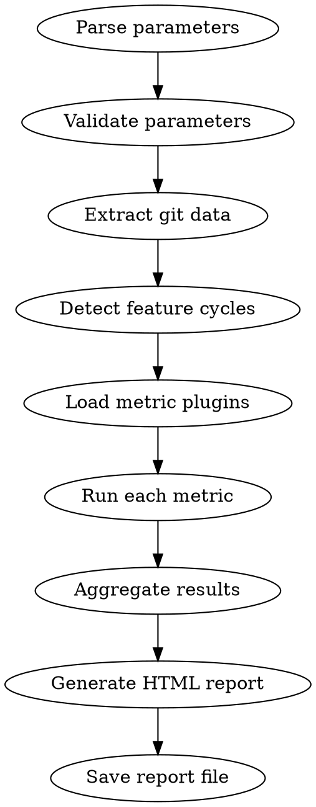

# Compliance Report

Generate a Git-based compliance and quality tracking report that shows whether development guardrails (fitness functions, BDD scenarios, ADRs, architecture characteristics) are being followed over time.

**Announce at start:** "I'm generating a compliance report from git history."

## When to Use

- When you need to see whether development guardrails are being followed over time
- After completing a feature cycle to check compliance
- When the user asks about workflow adherence, architecture erosion, or quality trends

**When NOT to use:**
- For individual code reviews — use `superflowers:requesting-code-review`
- For checking a single feature's tests — run the tests directly

## Architecture

This skill follows a **Microkernel** architecture:
- **Core:** This SKILL.md orchestrates analysis and report generation
- **Plugins:** Metric definitions in `metrics/` — each file defines one analysis dimension
- **Invariant:** Adding/removing a metric requires only changes in `metrics/`, never in this core file

## Invocation

```
/compliance-report                          # Full report, all features
/compliance-report --feature=<name>         # Single feature focus
/compliance-report --since=YYYY-MM-DD       # Features since date
```

## Process



### Step 1: Parse and Validate Parameters

Parse the invocation arguments:
- No arguments → full report
- `--feature=<name>` → filter to matching feature cycle
- `--since=YYYY-MM-DD` → filter to cycles after date

Validation:
- `--since` must be a valid date (YYYY-MM-DD format). If not, show error: "Invalid date format. Use YYYY-MM-DD."
- `--feature` value is validated against detected cycles. If no match, show: "No feature cycle found matching '<name>'."

### Step 2: Extract Git Data

Run these git commands to collect raw data:

```bash
# All commits with metadata
git log --all --format='%H|%ai|%an|%s' --no-merges

# All branches (including merged)
git branch -a --format='%(refname:short)|%(objectname:short)|%(committerdate:iso)'

# Merge commits (to detect merged feature branches)
git log --all --merges --format='%H|%ai|%s|%P'

# Check for shallow clone
git rev-parse --is-shallow-repository
```

**Fault tolerance:**
- If `git rev-parse --is-shallow-repository` returns "true", note this and proceed with available data
- If the repository has 0 commits, show "No commits found — nothing to analyze" and stop
- If any git command fails, skip that data source and add a warning

### Step 3: Detect Feature Cycles

A feature cycle is a group of related commits representing one development effort. Detection order:

1. **Worktree branches:** Look for branches matching `worktree/*` pattern in merge commits. Extract the feature name from the branch name.

2. **Spec commits:** Look for commits that create/modify `docs/superflowers/specs/*-design.md`. The spec filename date and topic become the cycle identifier.

3. **Feature file commits:** Look for commits that create/modify `features/*.feature` or `*.feature` files. Group with nearby spec/implementation commits.

4. **Branch-based grouping:** For remaining commits on non-main branches, group by branch name.

5. **Unassigned commits:** Commits on main that don't match any pattern → group as "unassigned".

For each cycle, collect:
- Name (from branch/spec/feature file)
- Start date (earliest commit)
- End date (latest commit or merge date)
- All commit hashes
- Associated spec files, feature files, ADR files

### Step 4: Load Metric Plugins

Read all `.md` files from the `metrics/` subdirectory of this skill (relative to SKILL.md location). Each file defines one metric with:
- **name** — metric identifier
- **description** — what it measures
- **weight** — relative importance for overall score (default 1.0)
- Analysis instructions, checks, scoring logic, visualization hints

If a metric file is malformed (missing required fields), log a warning and skip it. Other metrics are not affected.

### Step 5: Run Each Metric

For each loaded metric, against each detected feature cycle:
1. Follow the metric's analysis instructions
2. Execute the specified git commands
3. Calculate the metric's score and findings
4. Collect any warnings or drift alerts

If a metric fails during execution (e.g., unexpected git output), catch the error, add a warning to the report, and continue with remaining metrics.

### Step 6: Aggregate Results

For each feature cycle:
- **Compliance Score:** Weighted average of all metric scores (0-100%)
- **Findings:** List of passed/failed checks
- **Warnings:** Drift alerts, missing artifacts, etc.

Across all cycles:
- **Average Score:** Mean compliance score
- **Trend:** Direction of scores over time (improving/stable/declining)
- **Key Findings:** Most common issues across features
- **Drift Warnings:** Architecture erosion alerts

### Step 7: Generate HTML Report

Generate a **single HTML file** with ALL assets inline. Read the HTML template instructions from `report-template.md` in this skill's directory.

Key requirements:
- **Exactly 1 HTML file**, no external dependencies
- **All CSS inline** in `<style>` tags
- **All JavaScript inline** in `<script>` tags
- **Chart.js library inlined** (copy the minified source into the HTML)
- **All compliance data** embedded as a JSON block in a `<script>` tag
- **Valid HTML5** — proper doctype, charset, viewport meta
- **Responsive** — works on 1024px to 1920px viewports
- **Color coding** — Green (>85%), Yellow (60-85%), Red (<60%)

### Step 8: Save Report

Save the generated HTML to:
```
docs/superflowers/reports/YYYY-MM-DD-compliance-report.html
```

Where YYYY-MM-DD is today's date. Create the directory if it doesn't exist.

Show the user:
- Report file path
- Summary: number of features analyzed, average score, trend
- Any critical drift warnings

## Metric Plugin Format

Each metric file in `metrics/` follows this format:

```markdown
---
name: <metric-name>
description: <one-line description>
weight: <0.0-1.0, default 1.0>
---

## Analysis

<What to analyze and which git commands to use>

## Checks

<Individual checks with pass/fail criteria>

## Scoring

<How to calculate the 0-100% score>

## Visualization

<How results should appear in the HTML report>
```

See existing metrics in `metrics/` for examples.

## Fault Tolerance

| Situation | Behavior |
|-----------|----------|
| No architecture.md | Warning in report, architecture-related checks skipped |
| No .feature files | Warning in report, BDD-related checks show "no feature files" |
| No doc/adr/ | Warning in report, ADR checks show "no ADR directory" |
| Shallow clone | Report generated with available data, note about limited history |
| Empty repo (0 commits) | Message "No commits found", no report generated |
| Invalid --feature | Error message with available feature names |
| Invalid --since | Error message about date format |
| Malformed metric file | Warning, metric skipped, others unaffected |
| Metric execution error | Warning in report, other metrics continue |
| Corrupt git entries | Skip unreadable entries with warning |

## References

- `report-template.md` — HTML report template instructions
- `metrics/*.md` — Metric plugin definitions (auto-discovered, do not list individually)
- `architecture.md` (project root) — Architecture characteristics and fitness functions
- `quality-scenarios.md` (project root) — Quality scenarios
- `docs/superflowers/specs/2026-03-30-compliance-report-design.md` — Design specification
