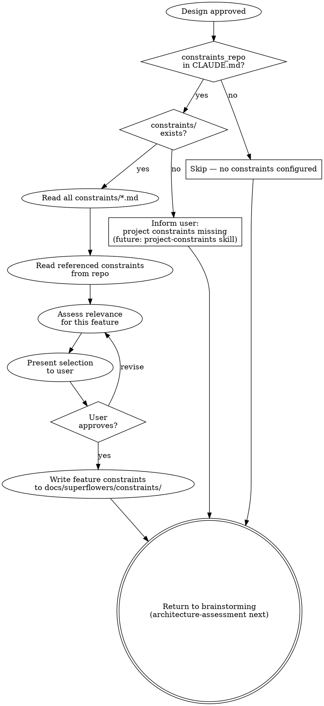

# Constraint Selection

Select organizational constraints relevant to the current feature. Constraints are rules, guidelines, and standards from outside the project (compliance, security, technology recommendations) that must be considered during specification and implementation.

**Announce at start:** "I'm selecting organizational constraints relevant to this feature."

## The Three Levels

```
Level 1: Constraint Repository (separate Git repo, all org constraints)
  ↓ filtered by
Level 2: Project Constraints (constraints/ dir in project, project-relevant subset)
  ↓ filtered by
Level 3: Feature Constraints (docs/superflowers/constraints/YYYY-MM-DD-<feature>.md)
```

## Prerequisites

The project's CLAUDE.md must contain:

```markdown
constraints_repo: /path/to/company-constraints
```

If `constraints_repo` is not configured or the path doesn't exist, skip this skill silently and proceed to architecture-assessment.

The project must have a `constraints/` directory with `.md` files that reference relevant constraints from the repository. If `constraints/` doesn't exist but `constraints_repo` IS configured, inform the user and recommend running `project-constraints`:

> "Ein Constraint-Repository ist konfiguriert, aber es gibt noch keine Projekt-Constraints (constraints/ Verzeichnis fehlt). Bitte zuerst `superflowers:project-constraints` ausführen um die Projekt-Constraints einzurichten. Überspringe Constraint-Selektion für dieses Feature."

Do NOT read the constraint repo directly — project-level constraint selection is handled by `superflowers:project-constraints`. Do NOT silently skip when a repo exists but project constraints are missing — the user should know.

## Process Flow



## Step 1: Read Project Constraints

Read all `.md` files in the project's `constraints/` directory. Each file represents a constraint category (e.g., `security.md`, `compliance.md`, `technology.md`).

Project constraint files reference constraints from the repository. The format is flexible — the skill reads the content and identifies constraint references (by ID, name, or file path).

## Step 2: Read Referenced Constraints from Repository

For each reference found in project constraint files, read the corresponding file from `constraints_repo`. The repository has no fixed structure — constraints can be organized in any way (flat, by category, nested).

For each constraint, extract:
- **Name/ID** (from frontmatter or heading)
- **Category** (security, compliance, technology, process, etc.)
- **Severity** (mandatory/recommended/optional — if stated, otherwise treat as recommended)
- **Applies-to tags** (if present in frontmatter)
- **Core requirement** (what must be done)
- **Verification criteria** (how to check compliance)

If a constraint file has no frontmatter, extract what you can from the content.

## Step 3: Assess Relevance for This Feature

For each project constraint, evaluate against the approved design:

1. **Mandatory constraints:** Always include. Flag if they conflict with the design.
2. **Recommended constraints:** Include if the feature touches the constraint's domain (data storage, APIs, UI, etc.).
3. **Optional constraints:** Exclude unless the user asks.

Use `applies_to` tags where available, otherwise assess based on the constraint's content and the feature's description.

## Step 4: Present Selection to User

Show the user:

> **Relevante Constraints für dieses Feature:**
>
> | # | Constraint | Kategorie | Severity | Grund |
> |---|-----------|-----------|----------|-------|
> | 1 | Encryption at Rest | Security | Mandatory | Feature speichert Daten |
> | 2 | API Authentication | Security | Mandatory | Feature hat REST-Endpunkte |
> | 3 | Spring Boot | Technology | Recommended | Webservice-Entwicklung |
>
> **Ausgeschlossen:**
> - Network Segmentation (Security) — Feature hat keine Netzwerk-Komponente
> - PCI-DSS (Compliance) — keine Zahlungsdaten
>
> Einverstanden, oder sollen Constraints hinzugefügt/entfernt werden?

Wait for user confirmation.

## Step 5: Independent Verification

After user confirmation, dispatch the `superflowers:constraint-reviewer` agent for independent verification. The reviewer gets:
- The approved feature design description
- The selected constraints (with reasons)
- The excluded constraints (with reasons)
- The path to the constraint repo and project constraints

The reviewer checks independently for missed constraints, false inclusions, incorrect exclusions, and process constraint classification.

```
Dispatch constraint-reviewer
  → APPROVED → proceed to Step 6
  → ISSUES_FOUND → fix issues → re-dispatch reviewer → repeat until APPROVED
```

Do NOT skip this step. The reviewer catches blind spots the original selection missed.

## Step 6: Write Feature Constraints

Save to `docs/superflowers/constraints/YYYY-MM-DD-<feature-name>-constraints.md`:

```markdown
# Constraints: <Feature Name>

## Datum: YYYY-MM-DD
## Feature: <short description of approved design>

## Aktive Constraints

### <Constraint Name> (<Category>, <Severity>)

**Anforderung:** <core requirement>

**Relevanz:** <why this applies to this feature>

**Prüfkriterien:**
- [ ] <verification criterion 1>
- [ ] <verification criterion 2>

**Quelle:** <path in constraint repo>

---

### <Next Constraint...>

## Ausgeschlossene Constraints

- <Name> (<Category>) — <reason for exclusion>
```

Commit the file.

## How Downstream Skills Use Feature Constraints

The feature constraints file is referenced by downstream skills when it exists:

- **architecture-assessment** reads constraints that affect architecture characteristics (e.g., security constraints → Security characteristic priority)
- **quality-scenarios** creates test scenarios from constraint verification criteria
- **feature-design** creates BDD scenarios for constraint requirements
- **writing-plans** lists active constraints in the plan header and creates compliance tasks
- **verification-before-completion** checks constraint verification criteria as an additional gate

## Integration

**Called after:** Brainstorming design approval (step 5)
**Runs before:** superflowers:architecture-assessment
**Produces:** `docs/superflowers/constraints/YYYY-MM-DD-<feature>-constraints.md`
**Read by:** architecture-assessment, quality-scenarios, feature-design, writing-plans, verification-before-completion
**Skips if:** No `constraints_repo` in CLAUDE.md or no `constraints/` directory
