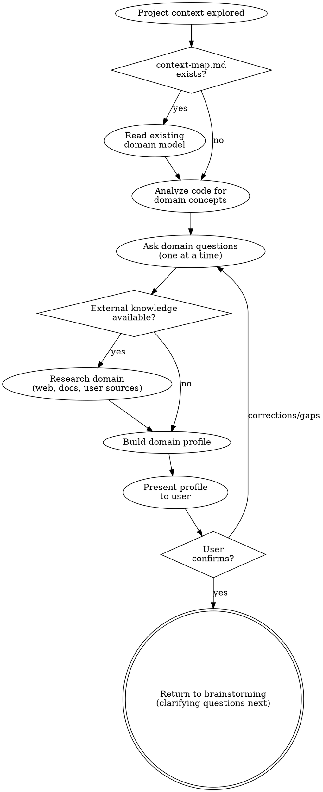

# Domain Understanding

Build a domain profile before design decisions are made. The agent must understand the business domain — its concepts, relationships, rules, and language — before asking design questions or proposing approaches.

## When to Use

- After exploring project context and before asking design questions in brainstorming
- When no domain profile (`domain-profile.md`) exists yet
- When the user says "die Domäne hat sich geändert" or "domain profile updaten"

**When NOT to use:**
- If a domain profile already exists and is current — skip and proceed to clarifying questions
- If found, ask: "Ein bestehendes Domänen-Profil wurde gefunden. Soll ich damit weiterarbeiten, oder möchtest du es aktualisieren?" Only re-run if the user explicitly opts in.

**Semantic anchors:** Domain-Driven Design (Eric Evans) for ubiquitous language and domain modeling, Event Storming (Alberto Brandolini) for domain event discovery, Domain Storytelling (Stefan Hofer/Henning Schwentner) for understanding domain workflows, Knowledge Crunching (Eric Evans) for extracting domain knowledge from experts and code.

**Announce at start:** "I'm building a domain profile to understand the business context before we start designing."

## Why This Exists

Without domain understanding, design questions are superficial. An agent asking "should we use a queue for payments?" without knowing that a payment has states (pending, authorized, captured, refunded) and that state transitions have business rules misses the point entirely. Domain understanding turns generic technical questions into informed domain questions.

## Process Flow



## Step 1: Read Existing Domain Artifacts

If `context-map.md` exists (from a previous bounded-context-design run):
- Read the ubiquitous language definitions
- Read the bounded contexts and their relationships
- Note the domain terms that are already established

If domain models exist in the code (entities, value objects, aggregates):
- Read them to understand the current domain model
- Note the terminology used in class names, method names, field names

## Step 2: Analyze Code for Domain Concepts

Read the project code to extract domain knowledge:

- **Entities/Models:** What are the core business objects? (User, Payment, Order, Invoice...)
- **States/Enums:** What states do entities go through? (PaymentStatus: PENDING, AUTHORIZED, CAPTURED, REFUNDED)
- **Business Rules:** What validation, constraints, or state transitions exist in the code?
- **Relationships:** How do entities relate? (A Payment belongs to a User, an Order contains Items)
- **Domain Events:** What happens in the system? (PaymentCreated, RefundRequested, OrderShipped)
- **Roles:** Who interacts with the system? (Customer, Merchant, Admin, System)

## Step 3: Ask Domain Questions

Ask the user targeted domain questions — one at a time. The goal is to fill gaps that the code doesn't answer.

**Types of questions:**

**Clarifying existing concepts:**
- "Im Code gibt es PaymentStatus mit PENDING und COMPLETED. Gibt es weitere Zustände die noch nicht implementiert sind?"
- "RefundPayment hat keine Validierung — darf jede Zahlung storniert werden, oder gibt es Business Rules?"

**Discovering hidden concepts:**
- "Gibt es Konzepte in der Domäne die noch nicht im Code existieren? Z.B. Reklamationen, Gutschriften, Teilzahlungen?"
- "Wer sind die Stakeholder? Nur Endkunden, oder auch Händler, Partner, interne Teams?"

**Understanding business rules:**
- "Was passiert wenn eine Zahlung fehlschlägt? Retry? Eskalation? Benachrichtigung?"
- "Gibt es zeitliche Constraints? Z.B. Stornierung nur innerhalb von 14 Tagen?"

**Domain language:**
- "Wenn ihr intern über 'Rückerstattung' sprecht — ist das dasselbe wie 'Refund' im Code?"

Only ask questions where the code leaves ambiguity. Don't ask what the code already clearly answers.

## Step 4: External Knowledge Sources

The domain profile can be enriched from external sources:

**Internet Research:**
- Research the domain (e.g., "payment processing domain model", "e-commerce order lifecycle")
- Industry standards and patterns (e.g., PCI-DSS for payments, FHIR for healthcare)
- Look for established domain models in the industry

**User-Provided Sources:**
If the user offers access to internal knowledge sources:
- **Confluence/Wiki:** Read relevant pages about domain concepts, business processes, glossaries
- **SharePoint:** Read process documentation, business rules documents
- **Knowledge Graphs/Ontologies:** If the user provides an ontology (OWL, RDF, or custom), use it to understand the domain's formal structure, relationships, and constraints
- **API Documentation:** Existing API docs often contain implicit domain knowledge
- **Event Catalogs:** If the team documents domain events, read them

Ask the user: "Gibt es interne Dokumentation zur Domäne? Z.B. in Confluence, einem Wiki, oder einem Glossar? Wenn ja, kann ich diese als Quelle einbeziehen."

Only ask once. If the user says no, proceed with code analysis and domain questions only.

## Step 5: Build Domain Profile

Compile everything into a **Domain Profile** — a concise document that captures the domain understanding:

```markdown
## Domain Profile: <Project/Feature Name>

### Core Concepts
| Concept | Description | Code Reference |
|---------|------------|----------------|
| Payment | A financial transaction from customer to merchant | PaymentController, Payment entity |
| Refund | Reversal of a payment, partial or full | refundPayment() |

### Domain States
| Entity | States | Transitions |
|--------|--------|-------------|
| Payment | PENDING → AUTHORIZED → CAPTURED → REFUNDED | PENDING→AUTHORIZED requires gateway response |

### Business Rules
- Refunds only allowed on CAPTURED payments
- Refund amount cannot exceed original payment
- ...

### Roles
- Customer: initiates payments
- Merchant: receives payments
- Admin: manages refunds, disputes

### Ubiquitous Language
| Term | Meaning | Context |
|------|---------|---------|
| Capture | Finalizing an authorized payment | Payment processing |
| Settlement | Transfer of captured funds to merchant | Accounting |

### Open Questions
- [Questions that couldn't be answered yet]

### Sources
- Code analysis: PaymentController.kt, Payment.kt
- User input: Refund rules, state transitions
- External: [if any]
```

## Step 6: Present to User

Present the domain profile and ask:
> "Hier ist mein Verständnis der Domäne. Stimmt das? Fehlt etwas Wichtiges?"

**Uncertainty handling:** If you are unsure about domain concepts (e.g., unclear relationships, ambiguous terminology), follow `references/uncertainty-handling.md`: highlight the uncertain areas explicitly with options for interpretation. Do NOT present guesses as facts.

Wait for confirmation. If the user corrects or adds:
- Update the profile
- Ask follow-up questions if needed
- Re-present until confirmed

The confirmed domain profile informs all subsequent brainstorming questions.

## Step 7: Save Domain Profile

Save the confirmed profile to `domain-profile.md` in the project root. Commit it. This persists the domain understanding across sessions — the next time this skill runs, it finds the file and skips (unless user opts in to update).

## Integration

**Called after:** Brainstorming Step 1 (Explore project context)
**Runs before:** Brainstorming Step 3 (Ask clarifying questions)
**Output:** `domain-profile.md` in project root
**Feeds into:** Brainstorming questions use domain language and concepts. Bounded-context-design (later) builds on this understanding.
**Read by:** bounded-context-design uses the domain profile as input for subdomain classification. All downstream skills can reference domain-profile.md for ubiquitous language.

## Red Flags — STOP

- Domain profile written without reading any project files or documentation
- All terms in the glossary are technical (no business terms)
- Business rules section is empty ("no special rules")
- Domain profile contradicts existing code or documentation
- Skipping domain expert interview questions ("we understand the domain")

## Rationalization Prevention

| Excuse | Reality |
|--------|---------|
| "The spec already explains the domain" | The spec explains features. The domain profile explains the business — rules, constraints, language. |
| "This domain is well-known (e-commerce, CRM, etc.)" | Every business has domain-specific rules. "Well-known" domains have the most hidden assumptions. |
| "We can learn the domain during implementation" | Implementation decisions without domain understanding produce technical solutions to business problems. |
| "The domain profile is just documentation" | The domain profile feeds bounded-context-design and feature-design. Wrong domain model → wrong boundaries → wrong architecture. |

## Verification Checklist

- [ ] Domain profile contains: business context, key entities, business rules, domain events, glossary
- [ ] Glossary uses business terms (not technical jargon)
- [ ] Business rules are concrete and testable (not vague "handle errors")
- [ ] Domain profile references project files or documentation as evidence
- [ ] User has confirmed the domain profile
- [ ] Output written to domain-profile.md

## The Bottom Line

Understand the domain before designing the solution. If the glossary is empty, the model is invented.
