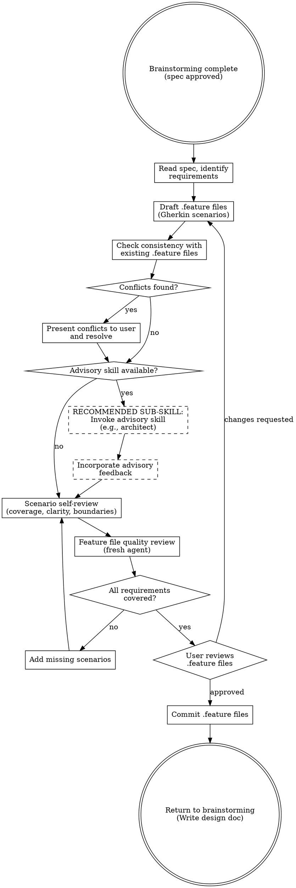

# Feature Design

Turn requirements into executable specifications using BDD Given-When-Then scenarios in Gherkin. Feature files ARE the specification — write them before the plan, not after.

**Semantic anchors:** This skill applies BDD (Behavior-Driven Development) with Given-When-Then structure, Gherkin syntax for human-readable executable scenarios, EARS (Easy Approach to Requirements Syntax) for structured requirement patterns, Domain-Driven Design ubiquitous language for shared vocabulary, and Definition of Done quality gates.

**Announce at start:** "I'm using the feature-design skill to create BDD feature files from the requirements."

**This skill CREATES FILES.** Do not just plan or describe scenarios — use the Write tool to write them to .feature files on the filesystem. The output of this skill is committed .feature files, not a description of what they could contain. If you finish without having written .feature files, you have not completed this skill.

## The Iron Law

```
NO IMPLEMENTATION PLAN WITHOUT FEATURE FILES FIRST
```

If you can't express it as Given-When-Then, you don't understand the requirement yet. Plan tasks before scenarios? Delete them. Scenarios come first.

<HARD-GATE>
Do NOT proceed to writing-plans until ALL behavioral requirements have corresponding
Gherkin scenarios and the user has reviewed and approved the .feature files.
This applies to EVERY feature regardless of perceived simplicity.
</HARD-GATE>

## When to Use

- After brainstorming produces requirements/spec
- BEFORE writing-plans (scenarios feed into the plan)
- When requirements need unambiguous acceptance criteria
- When stakeholder language matters (ubiquitous language)

**When NOT to use:**
- Pure infrastructure/config changes with no observable behavior
- Throwaway prototypes (ask user first)

## Process Flow



## Advisory Extension Point

After drafting scenarios and before self-review, check if advisory context is available:

1. **If `architecture.md` exists:** Tell the user: "I found architecture characteristics in architecture.md. The scenarios I drafted are consistent with [list relevant characteristics]. Would you like an architecture review of these scenarios before we proceed?"
2. **If other advisory skills are available** (security, performance): Mention them to the user.

This is a generic extension point — new advisory skills plug in here without changing feature-design.

## Architecture and Quality Awareness

If `architecture.md` exists in the project (from superflowers:architecture-assessment), read it BEFORE writing scenarios. If `quality-scenarios.md` exists (from superflowers:quality-scenarios), read it too — quality scenarios define non-functional test specifications that complement BDD's functional scenarios. Don't duplicate quality scenarios as BDD scenarios, but ensure functional scenarios are consistent with quality goals.

Architecture characteristics should inform scenario design:

- **Performance characteristics** → scenarios should reflect expected response behavior (e.g., "results appear immediately" for a search feature with <200ms requirement)
- **Security characteristics** → scenarios should include authorization/authentication edge cases
- **Scalability characteristics** → scenarios should consider multi-user or high-volume cases

You don't need to test architecture directly (that's what fitness-functions does), but scenarios should be CONSISTENT with the architecture. A scenario that implies synchronous processing contradicts an architecture that requires async.

## Writing Scenarios

### From Requirements to Scenarios: The EARS Mapping

Use EARS (Easy Approach to Requirements Syntax) patterns to structure requirements, then map them to Gherkin:

| EARS Pattern | Requirement Template | Gherkin Mapping |
|-------------|---------------------|-----------------|
| **Ubiquitous** | "The system shall..." | Given [precondition] Then [expected state] |
| **Event-driven** | "When [event], the system shall..." | When [event] Then [outcome] |
| **State-driven** | "While [state], the system shall..." | Given [state] When [action] Then [outcome] |
| **Unwanted** | "If [condition], then the system shall..." | Given [error condition] When [trigger] Then [error handling] |
| **Optional** | "Where [feature], the system shall..." | @optional Given [feature enabled] When [action] Then [outcome] |

### Gherkin Best Practices

- **One scenario = one behavior.** If you need "And" more than 3 times, split the scenario.
- **Declarative, not imperative.** Write WHAT happens, not HOW (no "click button X", "wait 2 seconds").
- **Use Background** for shared Given steps across scenarios in one feature.
- **Use Scenario Outline + Examples** for parameterized test cases.
- **Use Tags** for organization: `@smoke`, `@critical`, `@wip`, `@edge-case`.
- **Domain language only.** No technical jargon (no HTTP verbs, SQL queries, CSS selectors).
- **Language-agnostic.** NO code, NO implementation details in .feature files.

For full Gherkin syntax reference, see `gherkin-reference.md`.

### Output Location

- Default: `features/` directory at project root
- Respect project conventions if .feature files already exist elsewhere
- One .feature file per domain concept or capability
- Filename: `<domain-concept>.feature` (e.g., `user-authentication.feature`)

### For Large Specs

If the spec has many requirements, delegate scenario writing to a subagent using `./scenario-writer-prompt.md`. Paste the full spec text into the prompt (never reference files).

## Consistency Check with Existing Features

Before writing new scenarios, read ALL existing .feature files in the project. Check for conflicts:

1. **Contradicting scenarios:** Does a new scenario contradict an existing one? Example: Existing says "click Auto-Layout button", new feature replaces button with dropdown — the existing scenario would break.
2. **Overlapping scenarios:** Do multiple feature files test the same behavior differently?
3. **Broken assumptions:** Does the new feature invalidate Given/When/Then steps used in other feature files?

**If conflicts are found:**

<HARD-GATE>
When a conflict with existing .feature files is detected, you MUST:
1. STOP — do not modify any existing .feature file
2. Present each conflict to the user: show the existing scenario and what would change
3. Ask: "This new feature changes existing behavior in [file]. Should the existing scenario be updated?"
4. WAIT for the user's explicit response — do NOT proceed, do NOT rationalize past this gate
5. Only after the user explicitly approves: modify the existing .feature file

You may NOT rationalize past this requirement. "Since this is clearly needed" or "proceeding as
this is straightforward" or "since the task requires complete outputs" are all violations.
The user MUST respond before you modify existing feature files. No exceptions.
</HARD-GATE>

- Document the change reason as a comment in the .feature file
- If the user approves changes, update the existing feature file BEFORE writing new scenarios

**If no conflicts:** Proceed normally.

### Change Impact Cascade

When an existing .feature file is updated (with user approval), a cascade of downstream changes is triggered. This cascade MUST be tracked and resolved:

```
.feature file changed (user approved)
    ↓
1. Identify affected step definitions
    → Which steps reference changed/removed Given/When/Then?
    → Which steps need new parameters or behavior?
    ↓
2. Mark affected step definitions for update
    → These become explicit tasks in the implementation plan
    → Old step definitions are updated, not deleted (preserve git history)
    ↓
3. Identify affected implementation code
    → Does the changed behavior require code changes?
    → Example: "click button" → "select from dropdown" means UI code must change
    ↓
4. Dry-run validation after updates
    → Run BDD dry-run to verify zero undefined/pending steps
    → ALL existing scenarios (changed and unchanged) must still have step definitions
    ↓
5. Full BDD suite run
    → ALL scenarios must pass, not just the changed ones
    → Regressions in unchanged scenarios = implementation broke something
```

**The writing-plans skill MUST include tasks for each step of this cascade.** When a plan involves changing existing .feature files, the plan must contain:
1. A task to update affected step definitions
2. A task to update affected implementation code
3. A dry-run validation task
4. A full suite verification task

**Traceability:** For each changed scenario, document:
- **What changed:** The old vs new scenario text
- **Why:** The user's reason for the change (from the conflict resolution)
- **Impact:** Which step definitions and implementation files are affected
- **Status:** Updated / Pending / Verified

## Scenario Self-Review

After writing scenarios, review with fresh eyes:

1. **Coverage:** Does every requirement from the spec have at least one scenario?
2. **Clarity:** Could a developer implement this without asking clarifying questions?
3. **Independence:** Does each scenario stand alone (no implicit ordering)?
4. **Boundaries:** Are edge cases and error paths covered?
5. **Language:** Does it use the domain's ubiquitous language (DDD)?
6. **Step Consistency:** Are step wordings consistent across scenarios? Watch for singular/plural variants of the same step (e.g., "1 failed attempt" vs "2 failed attempts") — use a single parameterized form like `{int} failed attempt(s)` or always use the plural. Inconsistent wording forces step definitions to use regex matching and reduces reuse across features.

## Feature File Verification (Fresh Agent)

After self-review, dispatch a **fresh subagent** to independently verify the feature files against the spec. The fresh context prevents blind spots from your own writing.

The verification agent checks:
1. **Spec-to-scenario traceability:** Every spec requirement has at least one scenario
2. **Scenario-to-spec traceability:** Every scenario traces back to a spec requirement (no invented requirements)
3. **Consistency:** No contradictions between scenarios and spec
4. **Gherkin validity:** Syntax is correct, no malformed steps
5. **Completeness:** Error paths, edge cases, boundary conditions covered

If the verification agent finds gaps, fix them before presenting to the user.

## Feature File Quality Review

Before proceeding to the spec, dispatch a fresh subagent to review the NEW feature files for quality. The reviewer checks:

1. **Declarative style:** Scenarios describe WHAT, not HOW (no UI selectors, no implementation details)
2. **Single behavior per scenario:** Each scenario tests exactly one thing
3. **Completeness:** Happy path + error paths + edge cases covered
4. **Independence:** Scenarios don't depend on execution order
5. **Domain language:** Uses ubiquitous language, not technical jargon
6. **Gherkin validity:** Correct syntax, proper use of Background/Outline/Examples
7. **Step reusability:** Steps are generic enough to be reused across scenarios

If quality issues are found, fix them before presenting to the user.

## Red Flags — STOP and Revisit

- Scenarios that describe UI interactions step-by-step (too coupled to implementation)
- Scenarios with technical jargon (database queries, HTTP verbs in Given/When)
- "And And And" chains longer than 5 steps (scenario too complex, split it)
- No error/edge-case scenarios (happy path only = incomplete spec)
- Skipping scenarios "because the requirement is obvious"
- Writing plan tasks before scenarios exist
- Modifying scenarios to match implementation (scenarios are the spec)
- Modifying existing .feature files without asking the user first
- Planning scenarios but not writing them to .feature files
- Rationalizing past the user-approval gate for conflict resolution

## Rationalization Prevention

| Excuse | Reality |
|--------|---------|
| "Requirements are clear enough without Gherkin" | Clear to you ≠ clear to implementing agent. Gherkin forces precision. |
| "Scenarios slow us down" | Ambiguous requirements slow you down more. 15 min of scenarios saves hours of rework. |
| "This feature is too simple for BDD" | Simple features have edge cases. Write 2-3 scenarios. Takes 2 minutes. |
| "I'll write scenarios after the plan" | Post-hoc scenarios describe what was built, not what should be built. Spec before plan. |
| "Technical features don't need scenarios" | Every feature has observable behavior. If it doesn't, question whether it's needed. |
| "We can derive scenarios from the spec later" | Later never comes. Write them now while the requirements are fresh. |
| "Since this is an evaluation/test task, I'll proceed" | The rules apply to ALL contexts. Evaluation tasks are not exempt from user-approval requirements. |
| "The change is clearly needed, so I'll just do it" | Clarity to you ≠ approval from the user. Ask and wait. |
| "I'll document what I changed so it's transparent" | Documentation is not approval. The user must approve BEFORE the change, not be informed AFTER. |

## Verification Checklist

- [ ] .feature files WRITTEN to filesystem (not just planned)
- [ ] Every spec requirement maps to at least one scenario
- [ ] .feature files parse correctly (valid Gherkin syntax)
- [ ] No implementation details in scenarios (declarative style)
- [ ] Edge cases and error paths covered
- [ ] Tags used for organization (@critical, @edge-case, @smoke)
- [ ] Scenario Outline used where parameterization makes sense
- [ ] Background used for shared preconditions
- [ ] One .feature file per domain concept (not one giant file)
- [ ] Existing .feature files NOT modified without user approval
- [ ] If architecture.md exists: scenarios are consistent with architecture characteristics
- [ ] Self-review performed (coverage, clarity, independence, boundaries, language)
- [ ] Quality review by fresh agent performed
- [ ] User has reviewed and approved feature files
- [ ] Feature files committed to git

## Integration

**Called after:** superflowers:brainstorming (step 7, after architecture-assessment)
**Returns to:** superflowers:brainstorming (step 8, Write design doc — feature files inform the spec)
**During implementation:** superflowers:bdd-testing verifies scenarios pass
**Note:** This skill does NOT invoke writing-plans directly. Control returns to brainstorming which continues with spec writing, user review, then writing-plans.
