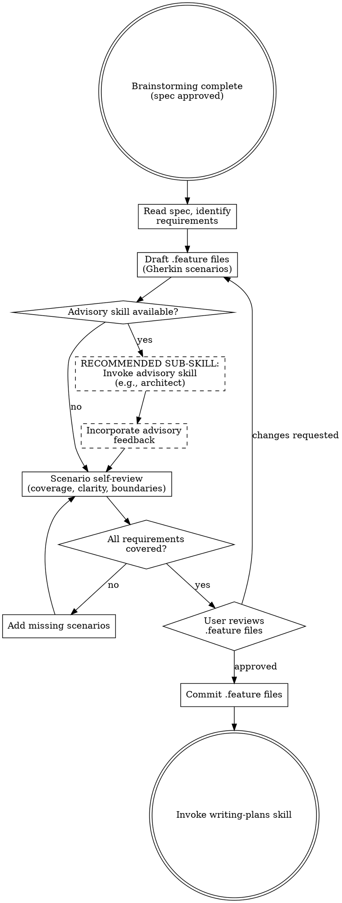

# Feature Design

Turn requirements into executable specifications using BDD Given-When-Then scenarios in Gherkin. Feature files ARE the specification — write them before the plan, not after.

**Semantic anchors:** This skill applies BDD (Behavior-Driven Development) with Given-When-Then structure, Gherkin syntax for human-readable executable scenarios, EARS (Easy Approach to Requirements Syntax) for structured requirement patterns, Domain-Driven Design ubiquitous language for shared vocabulary, and Definition of Done quality gates.

**Announce at start:** "I'm using the feature-design skill to create BDD feature files from the requirements."

## The Iron Law

```
NO IMPLEMENTATION PLAN WITHOUT FEATURE FILES FIRST
```

If you can't express it as Given-When-Then, you don't understand the requirement yet. Plan tasks before scenarios? Delete them. Scenarios come first.

<HARD-GATE>
Do NOT proceed to writing-plans until ALL behavioral requirements have corresponding
Gherkin scenarios and the user has reviewed and approved the .feature files.
This applies to EVERY feature regardless of perceived simplicity.
</HARD-GATE>

## When to Use

- After brainstorming produces requirements/spec
- BEFORE writing-plans (scenarios feed into the plan)
- When requirements need unambiguous acceptance criteria
- When stakeholder language matters (ubiquitous language)

**When NOT to use:**
- Pure infrastructure/config changes with no observable behavior
- Throwaway prototypes (ask user first)

## Process Flow



## Advisory Extension Point

**RECOMMENDED SUB-SKILL:** Before finalizing scenarios, invoke any available advisory skill for feasibility review. Advisory skills read the draft .feature files and return concerns or suggestions. Feature-design incorporates feedback, then proceeds.

Examples of advisory skills that can plug in here:
- Architecture advisor (shift-left feasibility review)
- Security advisor (threat scenarios)
- Performance advisor (load/stress scenarios)

This is a generic extension point — no changes to feature-design required when new advisory skills are added.

## Writing Scenarios

### From Requirements to Scenarios: The EARS Mapping

Use EARS (Easy Approach to Requirements Syntax) patterns to structure requirements, then map them to Gherkin:

| EARS Pattern | Requirement Template | Gherkin Mapping |
|-------------|---------------------|-----------------|
| **Ubiquitous** | "The system shall..." | Given [precondition] Then [expected state] |
| **Event-driven** | "When [event], the system shall..." | When [event] Then [outcome] |
| **State-driven** | "While [state], the system shall..." | Given [state] When [action] Then [outcome] |
| **Unwanted** | "If [condition], then the system shall..." | Given [error condition] When [trigger] Then [error handling] |
| **Optional** | "Where [feature], the system shall..." | @optional Given [feature enabled] When [action] Then [outcome] |

### Gherkin Best Practices

- **One scenario = one behavior.** If you need "And" more than 3 times, split the scenario.
- **Declarative, not imperative.** Write WHAT happens, not HOW (no "click button X", "wait 2 seconds").
- **Use Background** for shared Given steps across scenarios in one feature.
- **Use Scenario Outline + Examples** for parameterized test cases.
- **Use Tags** for organization: `@smoke`, `@critical`, `@wip`, `@edge-case`.
- **Domain language only.** No technical jargon (no HTTP verbs, SQL queries, CSS selectors).
- **Language-agnostic.** NO code, NO implementation details in .feature files.

For full Gherkin syntax reference, see `gherkin-reference.md`.

### Output Location

- Default: `features/` directory at project root
- Respect project conventions if .feature files already exist elsewhere
- One .feature file per domain concept or capability
- Filename: `<domain-concept>.feature` (e.g., `user-authentication.feature`)

### For Large Specs

If the spec has many requirements, delegate scenario writing to a subagent using `./scenario-writer-prompt.md`. Paste the full spec text into the prompt (never reference files).

## Scenario Self-Review

After writing scenarios, review with fresh eyes:

1. **Coverage:** Does every requirement from the spec have at least one scenario?
2. **Clarity:** Could a developer implement this without asking clarifying questions?
3. **Independence:** Does each scenario stand alone (no implicit ordering)?
4. **Boundaries:** Are edge cases and error paths covered?
5. **Language:** Does it use the domain's ubiquitous language (DDD)?

## Feature File Verification (Fresh Agent)

After self-review, dispatch a **fresh subagent** to independently verify the feature files against the spec. The fresh context prevents blind spots from your own writing.

The verification agent checks:
1. **Spec-to-scenario traceability:** Every spec requirement has at least one scenario
2. **Scenario-to-spec traceability:** Every scenario traces back to a spec requirement (no invented requirements)
3. **Consistency:** No contradictions between scenarios and spec
4. **Gherkin validity:** Syntax is correct, no malformed steps
5. **Completeness:** Error paths, edge cases, boundary conditions covered

If the verification agent finds gaps, fix them before presenting to the user.

## Red Flags — STOP and Revisit

- Scenarios that describe UI interactions step-by-step (too coupled to implementation)
- Scenarios with technical jargon (database queries, HTTP verbs in Given/When)
- "And And And" chains longer than 5 steps (scenario too complex, split it)
- No error/edge-case scenarios (happy path only = incomplete spec)
- Skipping scenarios "because the requirement is obvious"
- Writing plan tasks before scenarios exist
- Modifying scenarios to match implementation (scenarios are the spec)

## Rationalization Prevention

| Excuse | Reality |
|--------|---------|
| "Requirements are clear enough without Gherkin" | Clear to you ≠ clear to implementing agent. Gherkin forces precision. |
| "Scenarios slow us down" | Ambiguous requirements slow you down more. 15 min of scenarios saves hours of rework. |
| "This feature is too simple for BDD" | Simple features have edge cases. Write 2-3 scenarios. Takes 2 minutes. |
| "I'll write scenarios after the plan" | Post-hoc scenarios describe what was built, not what should be built. Spec before plan. |
| "Technical features don't need scenarios" | Every feature has observable behavior. If it doesn't, question whether it's needed. |
| "We can derive scenarios from the spec later" | Later never comes. Write them now while the requirements are fresh. |

## Verification Checklist

- [ ] Every spec requirement maps to at least one scenario
- [ ] .feature files parse correctly (valid Gherkin syntax)
- [ ] No implementation details in scenarios
- [ ] Edge cases and error paths covered
- [ ] User has reviewed and approved feature files
- [ ] Feature files committed to git

## Integration

**Called after:** superflowers:brainstorming
**Feeds into:** superflowers:writing-plans (scenarios become plan acceptance criteria)
**During implementation:** superflowers:bdd-testing converts scenarios to executable tests
