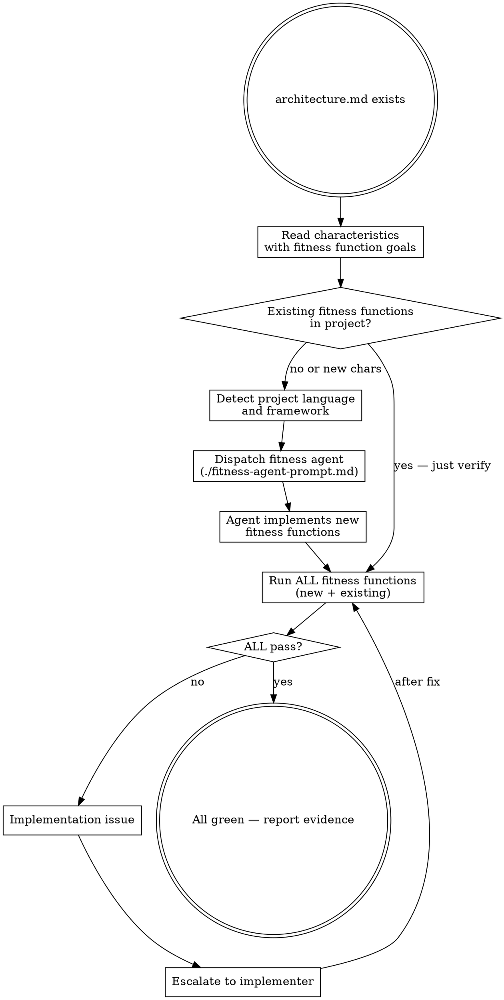

# Fitness Functions

Implement and execute automated fitness functions that verify architecture characteristics defined in architecture.md. Fitness functions are the architectural equivalent of unit tests — they guard non-functional requirements.

**Semantic anchors:** This skill applies ATAM (Architecture Tradeoff Analysis Method) quality attribute scenarios as testable assertions, Clean Architecture testability and dependency direction rules, and Definition of Done with architecture compliance as a mandatory gate.

**Announce at start:** "I'm using the fitness-functions skill to verify architecture compliance."

## The Iron Law

```
NO COMPLETION CLAIM WITHOUT ALL FITNESS FUNCTIONS PASSING
```

Architecture characteristics without automated verification are wishes, not constraints.

<HARD-GATE>
Do NOT claim implementation is complete, create PRs, or invoke
finishing-a-development-branch until ALL fitness functions pass.
No exceptions. Partial passage is failure.
</HARD-GATE>

## Immutability of Fitness Functions

<HARD-GATE>
During verification, existing fitness functions are IMMUTABLE:
- Do NOT modify fitness functions to weaken thresholds
- Do NOT delete fitness functions
- Do NOT skip or ignore failing fitness functions
- Do NOT change architecture.md goals to match current performance

If a fitness function fails, the IMPLEMENTATION must be fixed — not the test.

Exceptions (the only cases where FFs may be replaced):
1. The user explicitly changes the architecture characteristic in architecture.md because the requirement itself changed.
2. The ADR that justifies the FF has been **superseded** by a new ADR. When an ADR is superseded, all fitness functions referencing that ADR are replaced by the new ADR's fitness functions. This is not "weakening to pass" — it's a legitimized architecture change documented in the superseding ADR.

To verify a FF replacement is legitimate: check that a superseding ADR exists in `doc/adr/` with status "Accepted" and the old ADR's status is "Superseded by ADR-NNN".
</HARD-GATE>

## When to Use

- During implementation: when architecture.md exists and tasks affect architecture-relevant code
- At verification: before claiming any implementation is complete
- When new characteristics are added to architecture.md: implement corresponding fitness functions

**When NOT to use:**
- No architecture.md exists (use architecture-assessment first)
- Changes are purely cosmetic (no architecture impact)

## Process Flow



## Fitness Function Types (after Neal Ford)

| Type | Scope | Cadence | Example |
|------|-------|---------|---------|
| Code Structure | Atomic | Triggered (on commit) | No circular dependencies between modules |
| Complexity | Atomic | Triggered (on commit) | Cyclomatic complexity < 10 per function |
| Dependency | Atomic | Triggered (on commit) | Layer dependencies one-directional |
| Performance | Holistic | Triggered (on PR) | API response < threshold under load |
| Security | Atomic | Triggered (on commit) | No known CVEs in dependencies |
| Coverage | Atomic | Triggered (on commit) | Test coverage > threshold |

## Framework Detection

Based on project language, select appropriate tools:

| Language | Structure/Deps | Complexity | Performance | Security |
|----------|---------------|------------|-------------|----------|
| JS/TS | dependency-cruiser, eslint | eslint complexity rule | autocannon, k6 | npm audit |
| Java/Kotlin | ArchUnit | SonarQube, PMD | JMH, Gatling | OWASP dep-check |
| Python | import-linter, pylint | radon, pylint | locust, pytest-benchmark | safety, bandit |
| Go | go vet, depguard | gocyclo | go test -bench | govulncheck |
| Rust | cargo-deny | clippy | criterion | cargo audit |

For detailed templates per characteristic, see `function-templates.md`.

## Mapping architecture.md to Fitness Functions

There are TWO sources of fitness functions in architecture.md:

### Characteristic Fitness Functions
From the characteristics tables (Operational, Structural, Cross-Cutting):
1. For each characteristic where "Fitness Function" column says "Yes":
   - Identify the concrete goal (e.g., "API <200ms p95")
   - Select appropriate tool for the project language
   - Implement an automated test that verifies the goal

### Architecture Style Fitness Functions
From the "Architecture Style Fitness Functions" section (generated by architecture-style-selection):
1. For each fitness function in the table:
   - Implement the structural check using the suggested tool/approach
   - These enforce the selected style's invariants (e.g., "no shared database" for microservices, "no circular module dependencies" for modular monolith)
   - Style fitness functions are just as mandatory as characteristic fitness functions

### Rules for both types:
- New characteristics/styles get new fitness functions
- Existing fitness functions remain unchanged (immutable)
- Run ALL fitness functions (characteristic + style, new + existing) together

## The Fitness Agent

Dispatch a dedicated agent using `./fitness-agent-prompt.md`.

The fitness agent:
1. Reads architecture.md to understand characteristics and goals
2. Detects project language and available tooling
3. Implements fitness functions for characteristics lacking automated checks
4. Runs all fitness functions and reports results
5. Escalates implementation violations to the controller

**Model selection:** Use a standard model. Fitness function implementation is pattern matching on architecture characteristics.

## Independent Fitness Function Review

After implementing fitness functions, dispatch the `superflowers:fitness-function-reviewer` agent for independent verification of correctness, completeness, and immutability.

```
Dispatch fitness-function-reviewer
  → APPROVED → fitness functions are correct and complete
  → ISSUES_FOUND → fix issues → re-dispatch → repeat until APPROVED
  → CHANGE_REQUIRES_APPROVAL → existing FFs modified, user must approve + ADR required
```

## Red Flags — STOP

- Fitness functions that always pass (not actually testing anything)
- Thresholds changed to match current code (instead of fixing code)
- Fitness functions deleted because "they're too strict"
- Architecture.md goals modified to avoid failing fitness functions
- Fitness functions that test implementation details instead of architecture characteristics
- "We'll add fitness functions later" (later = never)

## Rationalization Prevention

| Excuse | Reality |
|--------|---------|
| "Fitness functions are overkill for this project" | If the architecture matters, verify it. If it doesn't, why did you define it? |
| "The threshold is too strict" | The threshold came from architecture-assessment. Change it there with the user, not here. |
| "This fitness function is slow" | Run it less frequently (nightly instead of per-commit). Don't remove it. |
| "Unit tests already cover architecture" | Unit tests verify behavior. Fitness functions verify structure and quality attributes. |
| "We can check this manually" | Manual checks are skipped under pressure. Automate it. |

## Verification Checklist

- [ ] Every critical characteristic in architecture.md has a fitness function
- [ ] Every architecture style fitness function in architecture.md is implemented
- [ ] All fitness functions pass (green)
- [ ] No existing fitness functions were modified or deleted
- [ ] All previously passing fitness functions still pass (no regressions)
- [ ] Full test run output captured as evidence
- [ ] Fitness functions test architecture characteristics, not business logic

## Integration

**Requires:** architecture.md from superflowers:architecture-assessment + superflowers:architecture-style-selection
**Used during:** Implementation (verify architecture compliance per task)
**Used at:** Verification (all fitness functions must pass before completion)
**Pairs with:** superflowers:bdd-testing (BDD for behavior, fitness functions for architecture)
**Style fitness functions from:** superflowers:architecture-style-selection (style-specific structural invariants)
