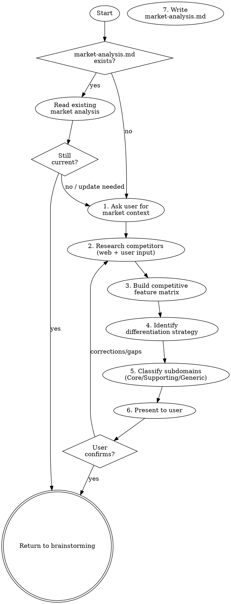

# Market Analysis

Understand the competitive landscape before making design decisions. Without market context, you cannot distinguish Core Subdomains (where you differentiate) from Generic Subdomains (where you buy/copy). This skill complements `superflowers:domain-understanding` — one looks inward (domain), the other outward (market).

**Semantic anchors:** Competitive Analysis, Porter's Five Forces, Blue Ocean Strategy (Kim/Mauborgne), SWOT Analysis, TAM/SAM/SOM Market Sizing, Competitive Feature Matrix, Core/Supporting/Generic Subdomain Classification (DDD).

**Announce at start:** "I'm running a market analysis to understand the competitive landscape and find differentiation opportunities."

## When to Use

- When entering a new problem space and the competitive landscape is unknown
- When the user asks "who are our competitors?" or "how do we differentiate?"
- Parallel to `superflowers:domain-understanding` during brainstorming — before clarifying questions
- When feature prioritization needs market context (table stakes vs. differentiators)

**When NOT to use:**
- If a `market-analysis.md` already exists and is current — read it instead
- For internal domain understanding — use `superflowers:domain-understanding`
- For purely technical projects with no market (internal tooling, infrastructure)

## Process Flow



## Step 1: Ask User for Market Context

Start by asking the user — they often know more about their market than any web search:

> "Bevor ich recherchiere — kennst du schon Wettbewerber oder alternative Lösungen in diesem Bereich? Und was ist dein geplanter Differenzierungspunkt?"

Capture:
- Known competitors (direct and indirect)
- Target market segment
- Intended differentiation
- Known market size or trends

If the user says "ich kenne den Markt nicht" — that's fine, proceed to research.

## Step 2: Research Competitors

Use web search to find competitors and alternatives. Search for:
- "[problem space] software"
- "[problem space] SaaS/tool/platform"
- "alternatives to [known competitor]"
- "[problem space] market size [current year]"
- Review sites (G2, Capterra, TrustPilot) for the category

For each competitor, capture:
- **Name and type** (direct competitor, indirect/alternative, potential entrant)
- **Target audience** (who they serve)
- **Core value proposition** (how they position themselves)
- **Key features** (what they offer)
- **Strengths** (what users praise — from reviews)
- **Weaknesses** (what users complain about — from reviews)
- **Pricing model** (if public)

**Uncertainty handling:** If it's unclear whether something is a direct competitor or an alternative, follow `references/uncertainty-handling.md`: present the classification options to the user and let them decide.

Aim for 3-5 direct competitors and 2-3 indirect alternatives. Don't try to be exhaustive — the goal is understanding the landscape, not a 50-page report.

## Step 3: Build Competitive Feature Matrix

Create a feature comparison table with a **Priorität** column — this is what `feature-design` uses to prioritize scenarios:

| Feature | Priorität | Wir | Comp A | Comp B | Alt C |
|---|---|---|---|---|---|
| Feature 1 | Table Stakes | geplant | ✓ | ✓ | ✓ |
| Feature 2 | Differenzierung | ★ geplant | ✗ | ~ | ✗ |
| Feature 3 | Nice-to-have | geplant | ✓ | ✗ | ✗ |

Legende: ✓ = vorhanden, ~ = teilweise, ✗ = fehlt, ★ = unser Differenzierungspunkt

Classify each feature:
- **Table Stakes** — ALL competitors have it → must have, no differentiation
- **Differenzierung** — competitors are weak or missing → our opportunity (mark with ★)
- **Nice-to-have** — some have it, not critical for market entry

## Step 4: Identify Differentiation Strategy

Based on the competitive matrix, identify:

1. **Where we compete** — features where we match competitors (table stakes)
2. **Where we differentiate** — features/capabilities where we excel or are unique
3. **Where we don't compete** — areas we intentionally skip

Use the Blue Ocean eliminate-reduce-raise-create grid if useful:
- **Eliminate** — industry factors we drop entirely
- **Reduce** — factors we scale back below standard
- **Raise** — factors we elevate above standard
- **Create** — factors the industry never offered

## Step 5: Classify Subdomains and Derive Architecture Implications

Two outputs from this step — both consumed by downstream skills:

### 5a: Subdomain Classification (→ bounded-context-design)

Map the differentiation strategy to DDD subdomain types:

| Typ | Definition | Investment |
|---|---|---|
| **Core** | Where we differentiate. No competitor does this well. | Highest — custom code, best engineers |
| **Supporting** | Enables the core but doesn't differentiate. Table-stakes features. | Moderate — pragmatic implementation |
| **Generic** | Commodity. Every competitor has it identically. | Lowest — buy/integrate, don't build |

Format the classification as a table with Subdomain, Typ, and Begründung columns — `bounded-context-design` reads this directly in Step 2.

### 5b: Architecture Implications (→ architecture-assessment)

For each differentiator and table-stakes feature, identify which quality requirements the market forces:

- If we differentiate on **integration** → Interoperability is a driving characteristic
- If we differentiate on **UX** → Usability is a driving characteristic
- If the market demands **compliance** (e.g., GDPR, certifications) → Security/Compliance are table-stakes characteristics
- If competitors are slow/unreliable → Performance/Availability become differentiators

Format as a table with Qualitätsanforderung, Markt-Treiber, and Relevanz columns — `architecture-assessment` reads this during the questionnaire phase.

## Step 6: Present to User

Present:
1. Competitor overview table
2. Feature comparison matrix
3. Differentiation strategy
4. Subdomain classification (Core/Supporting/Generic)

**Uncertainty handling:** If subdomain classification is ambiguous (e.g., a feature could be Core or Supporting depending on strategic direction), follow `references/uncertainty-handling.md`: present the options with tradeoffs and let the user decide.

> "Hier ist meine Analyse des Wettbewerbs. Stimmt das Bild? Fehlen Wettbewerber? Ist die Differenzierungsstrategie richtig?"

Wait for user confirmation. Iterate if the user has corrections or additional knowledge.

## Step 7: Write market-analysis.md

Persist to `market-analysis.md` in the project root. This artifact is consumed by downstream skills — the structure is optimized for that.

```markdown
# Market Analysis: [Produktname]

## Executive Summary
- Markt: [Branche/Segment]
- Größe: [TAM/SAM/SOM wenn bekannt]
- Wettbewerbsintensität: [niedrig/mittel/hoch]
- Differenzierungschance: [kurze Beschreibung]
- Markteintrittsbarrieren: [kurze Beschreibung der wichtigsten]

## Wettbewerber

| Wettbewerber | Typ | Stärken | Schwächen | Zielgruppe |
|---|---|---|---|---|
| ... | Direkt/Indirekt | ... | ... | ... |

## Feature-Vergleich (Competitive Matrix)

Legende: ✓ = vorhanden, ~ = teilweise, ✗ = fehlt, ★ = unser Differenzierungspunkt

| Feature | Priorität | Wir | Comp A | Comp B | Alt C |
|---|---|---|---|---|---|
| [Feature 1] | Table Stakes | geplant | ✓ | ✓ | ✓ |
| [Feature 2] | Differenzierung | ★ geplant | ✗ | ~ | ✗ |
| [Feature 3] | Nice-to-have | geplant | ✓ | ✗ | ✗ |

Priorität: "Table Stakes" = alle Wettbewerber haben es, Pflicht. "Differenzierung" = hier heben wir uns ab. "Nice-to-have" = optional.

## Subdomain-Klassifikation

> Consumed by: `superflowers:bounded-context-design` (Step 2)

| Subdomain | Typ | Begründung |
|---|---|---|
| [Subdomain A] | Core | [Warum hier die Differenzierung liegt] |
| [Subdomain B] | Supporting | [Nötig, aber kein Differenzierungsmerkmal] |
| [Subdomain C] | Generic | [Commodity — kaufen/integrieren statt bauen] |

## Architektur-Implikationen

> Consumed by: `superflowers:architecture-assessment` (Questionnaire)

Welche quality requirements erzwingt der Markt?

| Qualitätsanforderung | Markt-Treiber | Relevanz |
|---|---|---|
| [z.B. Interoperability] | [Wettbewerber X hat schlechte Integration → unsere Chance] | Hoch — Differenzierung |
| [z.B. Security] | [Branchenstandard, alle haben es] | Hoch — Table Stakes |
| [z.B. Usability] | [33% wollen wechseln wegen schlechter UX] | Hoch — Differenzierung |

## Markttrends
- [Trends die die Architektur oder Feature-Priorisierung beeinflussen]

## Risiken
- [Wettbewerberrisiken, regulatorische Risiken, Markteintrittsbarrieren]

## Quellen
- [Web-Recherche, User-Input, Branchenreports mit Links]
```

### Why this structure

- **Feature-Vergleich** hat eine Priorität-Spalte → `feature-design` weiß direkt was Table Stakes vs. Differenzierung ist
- **Subdomain-Klassifikation** als eigene Tabelle → `bounded-context-design` kann sie 1:1 übernehmen
- **Architektur-Implikationen** als eigene Tabelle → `architecture-assessment` weiß welche quality requirements der Markt erzwingt
- Jede Downstream-Sektion hat einen `> Consumed by:` Marker für Traceability

## Red Flags — STOP

- Analysis based on assumptions without researching actual competitors
- All competitors listed as "direct" (no indirect or alternative solutions considered)
- Differentiation strategy matches what every competitor already does
- Subdomain classification without market evidence ("this feels like Core")
- Skipping competitive UX review ("we know our competitors")

## Rationalization Prevention

| Excuse | Reality |
|---|---|
| "We don't have competitors" | Every problem has alternatives — even spreadsheets and manual processes count |
| "The user knows their market" | Users often have blind spots. Web research finds competitors they missed |
| "This is a technical project, no market" | If someone will use it, there's a market. Even internal tools compete with alternatives |
| "Market research takes too long" | 15-30 minutes of web search + user input. Not a multi-week engagement |
| "We can do this later" | Subdomain classification without market context leads to wrong Core/Generic decisions |

## Verification Checklist

- [ ] At least 3 competitors analyzed (direct or indirect)
- [ ] Feature comparison matrix with clear differentiation markers
- [ ] Subdomain classification complete (Core/Supporting/Generic with rationale)
- [ ] Quality requirements derived from market forces
- [ ] User has confirmed the analysis and differentiation strategy
- [ ] Output written to market-analysis.md

## The Bottom Line

Know your competition before you design your product. Core Subdomains are where you differentiate — everything else is table stakes.
