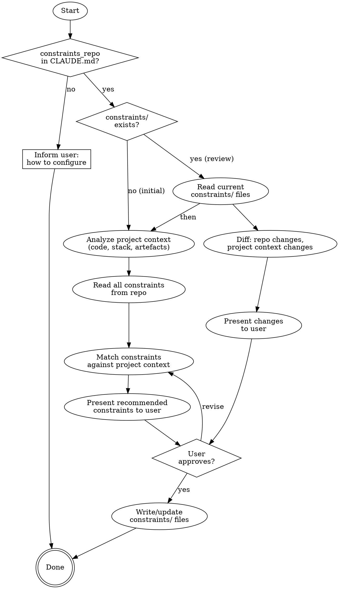

# Project Constraints

Select and maintain which organizational constraints apply to this project. Reads the project context (code, tech stack, architecture, data handling) and matches it against the constraint repository to recommend relevant constraints.

**Semantic anchors:** Organizational constraint repository, constraint catalog management, constraint lifecycle management.

**Announce at start:** "I'm reviewing project constraints against the organizational constraint repository."

## When to Use

- When setting up a new project and `constraints/` directory doesn't exist yet (initial setup)
- When the user explicitly asks to review or update project constraints
- When `constraint-selection` detects that `constraints_repo` is configured but `constraints/` is missing

**When NOT to use:**
- For per-feature constraint selection — use `superflowers:constraint-selection` instead
- If no `constraints_repo` is configured in CLAUDE.md — inform the user and stop

**Two modes:** Initial setup (no `constraints/`) creates the project baseline. Review mode (existing `constraints/`) checks for new, changed, or obsolete constraints.

## Prerequisites

CLAUDE.md must contain:

```markdown
constraints_repo: /path/to/company-constraints
```

If not configured, inform the user how to set it up and stop.

## Process Flow



## Step 1: Analyze Project Context

Read the project to understand what it does and what it uses. Check:

- **Language/Framework:** `package.json`, `pom.xml`, `build.gradle`, `pyproject.toml`, `go.mod`, `Cargo.toml` etc.
- **Data storage:** Database configs, ORM setup, migration files
- **APIs:** REST controllers, gRPC definitions, OpenAPI specs, route files
- **Personal data:** User models, PII fields, GDPR-related code
- **Security:** Auth middleware, JWT handling, encryption code
- **Deployment:** Dockerfiles, CI/CD configs, Kubernetes manifests
- **Existing artefacts:** `architecture.md`, `context-map.md`, `quality-scenarios.md`, `doc/adr/`

Build a **project profile** — a mental model of what this project is:

> "This is a Spring Boot web service with PostgreSQL, processing user data including email and payment info, deployed via Docker on Kubernetes. It has REST APIs with JWT authentication."

## Step 2: Read Constraint Repository

Read all `.md` files in the constraint repo (recursively). For each constraint, extract what you can:
- Name/ID (from frontmatter or first heading)
- Category (from frontmatter, directory name, or content)
- Severity (mandatory/recommended/optional — default: recommended)
- Applies-to tags (from frontmatter, if present)
- Core requirement summary

The repo has no fixed structure — handle flat files, nested directories, with or without frontmatter.

## Step 3: Match Constraints Against Project Context

For each constraint, assess relevance based on the project profile:

- **Data storage constraints** → relevant if project has DB/file storage
- **API/security constraints** → relevant if project exposes endpoints
- **PII/compliance constraints** → relevant if project handles personal data
- **Technology constraints** → relevant if project uses the specified tech area
- **Process constraints** → relevant based on deployment target (production vs. internal tool)
- **Infrastructure constraints** → relevant if project manages its own infra

Categorize each constraint as:
- **Relevant** — project context clearly matches constraint's domain
- **Not relevant** — project context doesn't match (with reason)
- **Uncertain** — could go either way, present to user for decision

**Process and infrastructure constraints** (deployment procedures, network setup, CI/CD rules) MUST be classified as **Uncertain** — never as Relevant. Examples: Four-Eyes-Prinzip, Change Management, Network Segmentation. These depend on organizational context (team structure, deployment target, operational model) that code analysis alone cannot determine. The user MUST decide.

If you catch yourself classifying a process constraint as Relevant: STOP. Move it to Uncertain. No exceptions.

A constraint's `severity: mandatory` means it's mandatory **when it applies** — not that it applies to every project. A mandatory encryption constraint is irrelevant for a project that doesn't store data. Mandatory ≠ always relevant.

<HARD-GATE>
BEFORE writing or creating constraints/ files, you MUST:
1. Present the COMPLETE selection (Relevant, Not Relevant, Uncertain)
2. Ask: "Soll ich die Projekt-Constraints so anlegen?"
3. STOP and WAIT for the user's explicit answer
4. Only AFTER the user confirms: write the files

Writing files before receiving confirmation is a HARD-GATE violation.
"I'll present what I wrote" is NOT confirmation — confirmation comes BEFORE writing.
This applies in BOTH Initial Setup and Review/Update mode.
</HARD-GATE>

## Step 4: Present to User

**Uncertainty handling:** If a constraint's relevance to this project is unclear, do NOT silently include or exclude it. Follow `references/uncertainty-handling.md`: categorize it as "Uncertain" in the table, explain why, and present options via AskUserQuestion. The user decides — you don't guess.

### Initial Setup Mode

> **Projekt-Profil:**
> Spring Boot Webservice, PostgreSQL, User-Daten mit PII, REST APIs, Docker/K8s Deployment
>
> **Empfohlene Constraints für dieses Projekt:**
>
> | Constraint | Kategorie | Severity | Grund |
> |---|---|---|---|
> | SEC-001 Encryption at Rest | Security | Mandatory | Projekt hat PostgreSQL |
> | SEC-002 API Authentication | Security | Mandatory | Projekt hat REST APIs |
> | COMP-001 GDPR Data Retention | Compliance | Mandatory | Projekt verarbeitet PII |
> | TECH-001 Spring Boot | Technology | Recommended | Projekt nutzt Spring Boot |
>
> **Nicht relevant:**
> - SEC-003 Network Segmentation — Infra wird separat gehandhabt
>
> **Unsicher (bitte entscheiden):**
> - PROC-001 Four-Eyes — Geht das Projekt in Produktion?
>
> Soll ich die Projekt-Constraints so anlegen?

### Review/Update Mode

> **Änderungen seit letztem Review:**
>
> **Neue Constraints im Repo:**
> - SEC-004 Container Scanning — Relevant? (Projekt nutzt Docker)
>
> **Projekt-Kontext geändert:**
> - Neues Feature mit Zahlungsdaten → COMP-003 PCI-DSS jetzt relevant?
>
> **Bestehende Constraints weiterhin relevant:** ✓ alle aktuell
>
> Soll ich die Projekt-Constraints aktualisieren?

Wait for user confirmation before writing.

## Step 4b: Independent Verification

After user confirmation, dispatch the `superflowers:project-constraint-reviewer` agent. The reviewer independently reads the project code and constraint repo to verify the analysis.

```
Dispatch project-constraint-reviewer
  → APPROVED → proceed to Step 5
  → ISSUES_FOUND → fix issues → re-dispatch reviewer → repeat until APPROVED
```

<HARD-GATE>
Follow the Review-Loop Pattern from agents/reviewer-protocol.md exactly:
1. Dispatch project-constraint-reviewer (fresh)
2. If ISSUES_FOUND: fix the cited issues, then re-dispatch reviewer (fresh, step 1)
3. Repeat until reviewer returns APPROVED
4. Only then proceed to Step 5
Do NOT skip re-dispatch. Do NOT ask the user whether to fix. Fix and re-review.
</HARD-GATE>

## Step 5: Write constraints/ Files

Create or update `constraints/` directory with one `.md` per category:

```markdown
# Security Constraints

## Aktiv

- **SEC-001**: Encryption at Rest — Alle Daten verschlüsselt speichern
- **SEC-002**: API Authentication — OAuth 2.0 / JWT für alle Endpunkte

## Nicht relevant für dieses Projekt

- **SEC-003**: Network Segmentation — Infra wird vom Plattform-Team gehandhabt
```

Group by category (security, compliance, technology, process, etc.). Include exclusions with reasons.

Commit the files.

## Rationalization Prevention

| Excuse | Reality |
|--------|---------|
| "It's mandatory, so it applies" | Mandatory means mandatory **when the domain matches**. A mandatory encryption rule doesn't apply to a project that stores nothing. |
| "Better safe than include it" | Over-including constraints creates noise and wastes effort. Exclude what doesn't apply, mark uncertain ones for user decision. |
| "I'll just write the files, user can review later" | User confirmation BEFORE writing is a HARD-GATE. Presenting after the fact is not confirmation. |
| "Process constraints always apply to production projects" | Process constraints depend on deployment target, team structure, and org context — only the user knows these. Mark as Uncertain. |
| "The project profile is obvious, I'll skip it" | Present the profile explicitly. The user must see what YOU understood about the project to verify your constraint matching is based on correct assumptions. |

## Red Flags — STOP

- Writing constraints/ without user confirmation
- Classifying all mandatory constraints as Relevant regardless of project match
- Skipping the Uncertain category — if you have 0 uncertain constraints, you're over-confident
- Not presenting a project profile — constraint matching is only as good as the context analysis

## The Bottom Line

Constraints are organizational reality. Ignoring them doesn't make them go away.

## Integration

**Triggered by:** User explicitly, or recommended by `constraint-selection` when `constraints/` is missing
**Produces:** `constraints/*.md` files in the project
**Read by:** `constraint-selection` (which then selects per-feature constraints)
**Reads:** CLAUDE.md (repo path), all project files (context), constraint repo (all constraints)
