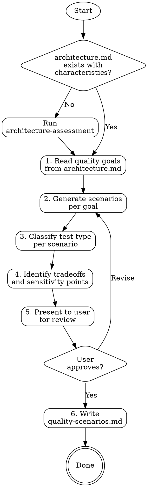

# Quality Scenarios

> "If you can't measure it, you can't manage it." — ATAM principle

Transform abstract architecture characteristics into concrete, testable quality scenarios.
Each scenario gets the right test type — not everything needs to be a fitness function.

**Semantic anchors:** ATAM (Architecture Tradeoff Analysis Method) for quality attribute scenarios,
arc42 Section 10 (Quality Requirements) for quality tree structure,
ISO 25010 for quality model categories.

**Announce at start:** "I'll create quality scenarios from the architecture characteristics — concrete test specifications with the right test type for each one."

## The Iron Law

```
NO QUALITY GOAL WITHOUT A TESTABLE SCENARIO
```

Every characteristic with a concrete goal in architecture.md gets at least one quality scenario.
A scenario without a response measure is not a scenario — it's a wish.

## Process Flow



## Step 1: Read Quality Goals

Read `architecture.md` and extract every row from the characteristics tables where a concrete goal exists. Also read:
- The **Top 3 Priority Characteristics** (these get more scenarios)
- The **Selected Architecture Style** section (style context influences scenarios)
- The **Architecture Style Fitness Functions** (do NOT duplicate these — they're already covered)

For each characteristic, note:
- The characteristic name
- Its priority (Critical / Important / Nice-to-have)
- The concrete goal (this becomes the response measure)
- Whether it already has a fitness function

Also read the most recent feature constraints file from `docs/superflowers/constraints/` if it exists. Constraint verification criteria that are testable become additional quality scenarios — categorized by the appropriate test type. For example, "All databases use TDE" → fitness-function, "No sensitive data in logs" → integration-test.

## Step 2: Generate Scenarios

For each quality goal, create one or more ATAM scenarios. A scenario makes the abstract goal concrete by specifying WHO triggers WHAT under WHICH conditions, and what SUCCESS looks like.

### Scenario Format

```markdown
### QS-NNN: [Descriptive Title]
- **Characteristic:** [from architecture.md]
- **Source:** [Who/what causes the stimulus — user, system, external service, time-based trigger]
- **Stimulus:** [What happens — a request, a failure, a load spike, a configuration change]
- **Environment:** [Under what conditions — normal load, peak load, degraded mode, cold start]
- **Artifact:** [What part of the system — API endpoint, database, message queue, UI component]
- **Response:** [What the system should do]
- **Response Measure:** [Concrete metric from the quality goal]
- **Test Type:** [See classification guide below]
```

### How many scenarios per goal?

- **Critical characteristics in Top 3:** 2-3 scenarios covering different environments (normal, peak, degraded)
- **Important characteristics:** 1-2 scenarios covering the primary environment
- **Nice-to-have:** 1 scenario for the happy path

Don't generate scenarios for characteristics that are already fully covered by architecture style fitness functions. Those structural invariants are enforced separately.

## Step 3: Classify Test Type

Each scenario gets exactly one test type. The type is determined by what's being tested, not by what sounds impressive. Here's the decision guide:

| Test Type | When to use | Examples |
|---|---|---|
| **unit-test** | Tests a single component's quality behavior in isolation. No external dependencies. Fast, runs on every commit. | Input validation, error handling, algorithm correctness, data transformation |
| **integration-test** | Tests quality across component boundaries. Needs real dependencies (DB, queue, API). | Cross-service data consistency, API contract compliance, auth flow, transaction integrity |
| **load-test** | Tests behavior under volume or stress. Needs a running system. | Response time under load, throughput limits, connection pool behavior, memory under sustained traffic |
| **chaos-test** | Tests resilience to failures. Needs infrastructure to inject faults. | Node failure recovery, network partition handling, graceful degradation, data loss prevention |
| **fitness-function** | Tests structural/architectural invariants. Runs as static analysis or CI check. No running system needed. | Dependency direction, module boundaries, complexity limits, coverage thresholds |
| **manual-review** | Cannot be fully automated. Requires human judgment. | Usability, accessibility audit, documentation completeness, UX consistency |

**Decision heuristic:** Ask "does this need a running system?" If no → unit-test or fitness-function. If yes → integration-test, load-test, or chaos-test depending on what's being stressed.

**Important:** A characteristic fitness function from architecture.md (like ">80% coverage") is already a fitness function — don't create a duplicate scenario. A style fitness function (like "no shared database") is also already handled. Only create new scenarios for quality goals that don't have a fitness function yet, or where the fitness function only covers part of the goal.

## Step 4: Identify Tradeoffs

ATAM's core insight is that quality attributes conflict. After generating scenarios, look for tensions:

**Sensitivity points:** A scenario where changing one architectural parameter significantly affects the quality response.
- Example: "Increasing cache TTL improves performance (QS-001) but degrades data consistency (QS-007)"

**Tradeoff points:** A scenario where improving one characteristic necessarily worsens another.
- Example: "Full audit logging (QS-012) adds 15ms latency per request, conflicting with the <100ms response target (QS-003)"

Document these as a dedicated section in quality-scenarios.md. Tradeoffs are valuable — they surface decisions that the team needs to make consciously rather than discovering them during implementation.

When a tradeoff is resolved (the user decides which side to favor), invoke `superflowers:architecture-decisions` to create an ADR. Tradeoff resolutions are architecture decisions — documenting them ensures the team remembers why they accepted the tradeoff.

## Step 5: Present to User

Show the user:
1. The scenario table (all scenarios with test types)
2. Any tradeoffs identified
3. Ask for review: "Do these scenarios cover your quality goals? Any missing? Any test types you'd change?"

Wait for user confirmation before writing the file.

## Step 5b: Independent Verification

After user confirmation, dispatch the `superflowers:quality-scenario-reviewer` agent. The reviewer independently verifies coverage, test types, duplicates, conflicts, and immutability.

```
Dispatch quality-scenario-reviewer
  → APPROVED → proceed to Step 6
  → ISSUES_FOUND → fix issues → re-dispatch reviewer → repeat until APPROVED
  → CHANGE_REQUIRES_APPROVAL → present changes to user for 4-eyes approval
```

<HARD-GATE>
Follow the Review-Loop Pattern from agents/reviewer-protocol.md exactly:
1. Dispatch quality-scenario-reviewer (fresh)
2. If ISSUES_FOUND: fix the cited issues, then re-dispatch reviewer (fresh, step 1)
3. Repeat until reviewer returns APPROVED
4. Only then proceed to Step 6
Do NOT skip re-dispatch. Do NOT ask the user whether to fix. Fix and re-review.
</HARD-GATE>

## Step 6: Write quality-scenarios.md

Persist to `quality-scenarios.md` in the project root.

### quality-scenarios.md Format

```markdown
# Quality Scenarios

Generated from architecture.md quality goals using ATAM.

## Last Updated: YYYY-MM-DD

## Scenario Summary

| ID | Characteristic | Scenario | Test Type | Priority |
|----|---------------|----------|-----------|----------|
| QS-001 | Performance | API response under peak load | load-test | Critical |
| QS-002 | Security | Unauthorized access attempt | integration-test | Critical |
| ... | ... | ... | ... | ... |

## Test Type Distribution

| Test Type | Count | Scenarios |
|-----------|-------|-----------|
| unit-test | N | QS-xxx, QS-xxx |
| integration-test | N | QS-xxx, QS-xxx |
| load-test | N | QS-xxx |
| chaos-test | N | QS-xxx |
| fitness-function | N | QS-xxx |
| manual-review | N | QS-xxx |

## Scenarios

[Full scenario definitions here, grouped by characteristic]

## Tradeoffs and Sensitivity Points

### Tradeoff: [Title]
- **Tension:** [Characteristic A] vs [Characteristic B]
- **Scenarios affected:** QS-xxx, QS-xxx
- **Decision needed:** [What the team must decide]

### Sensitivity Point: [Title]
- **Parameter:** [What can be tuned]
- **Affects:** QS-xxx ([how])
- **Current setting:** [value]
```

## Red Flags — STOP

- **Vague response measures:** "Good performance" is not a scenario. "p95 < 200ms under 1000 concurrent users" is.
- **All scenarios are fitness functions:** If every scenario is a fitness function, you're missing integration tests, load tests, and manual reviews. Real systems need diverse test types.
- **All scenarios are load tests:** Not every quality attribute is about performance. Security, maintainability, and testability need scenarios too.
- **Duplicating style fitness functions:** architecture-style-selection already generated structural checks. Don't create scenarios for "no circular dependencies" or "no shared database" — those are covered.
- **Ignoring tradeoffs:** If you have 10+ scenarios and zero tradeoffs, you haven't looked hard enough. Quality attributes almost always conflict.
- **Scenarios without environments:** "The API responds fast" is meaningless. Under what conditions? Normal load? Peak? Cold start? Degraded mode?

## Rationalization Prevention

| Excuse | Reality |
|--------|---------|
| "We'll figure out the test type later" | The test type determines implementation effort. A load test is 10x more work than a unit test. Classify now. |
| "Everything should be a fitness function" | Fitness functions verify structure and thresholds. They can't test how the system behaves under load or across service boundaries. Use the right tool. |
| "We don't need scenarios for nice-to-have characteristics" | Nice-to-have still means "we want this." One scenario keeps it visible. Zero scenarios means it's forgotten. |
| "The BDD scenarios cover quality" | BDD scenarios test functional behavior. Quality scenarios test non-functional attributes. Both are needed. |
| "Manual review isn't a real test" | Some qualities (usability, documentation) require human judgment. Pretending they can be automated leads to useless automated checks. |

## Verification Checklist

- [ ] Every characteristic with a concrete goal in architecture.md has at least one scenario
- [ ] Top 3 characteristics have 2-3 scenarios each (different environments)
- [ ] Every scenario has a concrete response measure (number, threshold, or observable outcome)
- [ ] Test types are diverse (not all fitness functions, not all load tests)
- [ ] Style fitness functions from architecture.md are NOT duplicated
- [ ] Tradeoffs between conflicting characteristics are documented
- [ ] User has reviewed and approved the scenarios
- [ ] quality-scenarios.md written to project root

## Integration

- **Called after:** `superflowers:architecture-style-selection` (needs style context and style FFs)
- **Runs before:** `superflowers:feature-design` (BDD scenarios can reference quality scenarios)
- **Informs:** `superflowers:writing-plans` (test tasks categorized by type from quality scenarios)
- **Feeds into:** `superflowers:fitness-functions` (only scenarios typed as fitness-function)
- **Checked by:** `superflowers:verification-before-completion` (all scenarios must have corresponding tests)

## Reference Files

- `references/test-type-guide.md` — Detailed decision tree for classifying scenarios into test types, with examples per characteristic and language-specific tooling recommendations
