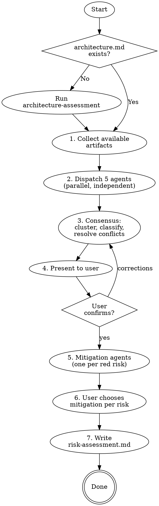

# Risk Storming

Collaborative architecture risk identification using parallel agents as team members — each with a different perspective, assessing independently before reaching consensus. Based on Simon Brown's [Risk Storming](https://riskstorming.com/) technique, featured in Ford/Richards "Fundamentals of Software Architecture" (Chapter 22).

**Semantic anchors:** Risk Storming (Simon Brown), Architecture Tradeoff Analysis Method (ATAM), Risk Matrix (Probability x Impact), Architecture Risk Assessment, Fitness Functions (Ford/Richards), Architecture Drift Detection.

**Announce at start:** "I'm running a risk storming session — dispatching 5 independent agents to assess architecture risks from different perspectives."

## When to Use

- After architecture-style-selection as the next step in the workflow
- When the user asks for a risk assessment or wants to find architecture weaknesses
- After major feature implementations to check for new risks
- Periodically to track whether risks are improving or deteriorating

**When NOT to use:**
- If `architecture.md` doesn't exist — run `superflowers:architecture-assessment` first
- For individual code bugs — use `superflowers:systematic-debugging`
- For compliance checks only — use `superflowers:constraint-selection`

## Process Flow



## Step 1: Collect Available Artifacts

Check which artifacts exist. Not all projects have all artifacts — dispatch only agents whose documents are available.

| Artifact | Location | Required? |
|---|---|---|
| `architecture.md` | Project root | **Yes** — no risk storming without architecture |
| `context-map.md` | Project root or docs/ | No — skip bounded context analysis if missing |
| `quality-scenarios.md` | Project root or docs/ | No — agents assess without quality baseline |
| `constraints/*.md` | Project constraints dir | No — skip constraint-specific risks |
| `doc/adr/` | ADR directory | No — skip ADR consistency checks |
| `market-analysis.md` | Project root | No — skip market/integration risks |
| Source code | `src/` or project root | No — skip code-level analysis if no code exists yet |

## Step 2: Dispatch 5 Perspective Agents (Parallel)

Dispatch all 5 agents simultaneously using `superflowers:dispatching-parallel-agents`. Each agent sees ONLY the architecture artifacts and source code — NOT the other agents' results. This simulates the "silent, individual assessment" phase of Risk Storming.

Each agent produces a risk list in this format:

```markdown
| Risiko | Architektur-Bereich | Wahrscheinlichkeit (L/M/H) | Impact (L/M/H) | Score | Rating |
```

Score = W x I (L=1, M=2, H=3). Rating: Green (1-2), Yellow (3-4), Red (6-9).

### Agent 1: Security & Compliance

**Focus:** Security vulnerabilities, compliance violations, data protection gaps.

**Reads:** `architecture.md`, `constraints/*.md`, `quality-scenarios.md`, `doc/adr/`, Source Code

**Looks for in artifacts:** Security characteristics and their concrete goals. Active compliance constraints (GDPR, HIPAA, etc.). Security quality scenarios and whether they have test coverage.

**Looks for in code:** Missing authentication/authorization checks. Secrets or credentials in code. SQL injection, XSS, or other OWASP risks. Unencrypted sensitive data. Missing input validation at system boundaries.

### Agent 2: Performance & Scalability

**Focus:** Bottlenecks, scaling limits, resource constraints.

**Reads:** `architecture.md`, `quality-scenarios.md`, `context-map.md`, Source Code

**Looks for in artifacts:** Performance/Scalability characteristics and concrete targets. Load test scenarios. Service boundaries that affect latency (context map).

**Looks for in code:** N+1 query patterns. Missing caching. Synchronous calls that should be async. Unbounded collections or queries. Missing pagination. Thread pool or connection pool sizing.

### Agent 3: Operational & Availability

**Focus:** Single points of failure, deployment risks, monitoring gaps.

**Reads:** `architecture.md`, `quality-scenarios.md`, `doc/adr/`, Source Code

**Looks for in artifacts:** Availability and fault tolerance characteristics. Infrastructure decisions in ADRs. Disaster recovery scenarios.

**Looks for in code:** Missing health check endpoints. No graceful shutdown handling. Logging gaps (silent failures). Missing circuit breakers or retry logic. No timeout configuration on external calls. Missing monitoring/metrics instrumentation.

### Agent 4: Data & Integration

**Focus:** Data consistency, integration fragility, vendor lock-in.

**Reads:** `context-map.md`, `architecture.md`, `constraints/*.md`, `market-analysis.md`, Source Code

**Looks for in artifacts:** Context boundaries and how data flows between them. Interoperability characteristics. Data-related constraints. External dependencies from market analysis.

**Looks for in code:** Missing transaction boundaries. Inconsistent serialization formats. Tight coupling to specific vendors/APIs (no abstraction layer). Missing data validation at integration points. Eventual consistency without conflict resolution.

### Agent 5: Developer (Architecture Drift)

**Focus:** Where code reality diverges from planned architecture.

**Reads:** `architecture.md`, `context-map.md`, `.feature` files, `doc/adr/`, Source Code

**Looks for:** Layer violations (e.g., controller calling repository directly). Wrong dependency directions. Code structure doesn't match context-map boundaries. ADR decisions not reflected in code. Feature files describe behavior the code doesn't implement. Style-specific invariants violated (e.g., shared database in microservices architecture).

## Step 3: Consensus

Collect all risks from the 5 agents and consolidate:

1. **Group by architecture area** — which module/component/layer does the risk affect?
2. **Classify agreement:**
   - **Agreement** (2+ agents identify same risk) → high confidence, use highest rating
   - **Contradiction** (agents rate differently) → present both ratings to user
   - **Unique** (only 1 agent) → possible blind spot, flag for user review
3. **Consolidate ratings** — for agreements, use the highest individual rating. For contradictions, present both.

**Uncertainty handling:** When agents disagree on a risk rating, follow `references/uncertainty-handling.md`: present both assessments with their reasoning and let the user decide the final rating.

## Step 4: Present to User

Present the consolidated risk assessment:

1. **Risk Matrix** — overview grid (modules x perspectives, color-coded)
2. **Risk Register** — all risks sorted by rating (Red first)
3. **Agreements** — risks where 2+ agents agree (highest confidence)
4. **Contradictions** — risks where agents disagree (user decides)
5. **Unique findings** — risks only 1 agent saw (blind spot check)

> "Hier ist das Ergebnis des Risk Stormings. [N] Risiken identifiziert, davon [X] rot, [Y] gelb, [Z] grün. [A] Übereinstimmungen, [B] Widersprüche die deine Entscheidung brauchen."

Wait for user confirmation. Iterate if corrections needed.

## Step 5: Mitigation (Red Risks Only)

For each Red-rated risk, dispatch a mitigation agent that proposes 2-3 options:

Each option includes:
- **What:** Concrete mitigation action
- **Effort:** S (hours) / M (days) / L (weeks)
- **Tradeoff:** What this costs or makes harder
- **Recommendation:** Why this option (or why not)

Present options to user via AskUserQuestion with structured choices. User decides per risk:
- Mitigate (choose option)
- Accept (consciously accept the risk)
- Defer (revisit later)

## Step 6: Write risk-assessment.md

Persist to `risk-assessment.md` in the project root.

```markdown
# Risk Assessment: [Projektname]
Datum: YYYY-MM-DD
Trigger: [Nach Style-Selection / Manuell / Nach Feature X]

## Risk Matrix

| Bereich | Security | Performance | Operational | Data | Code-Drift |
|---|---|---|---|---|---|
| [Module A] | Rating | Rating | Rating | Rating | Rating |

## Risk Register

| # | Risiko | Bereich | Identifiziert von | W | I | Rating | Status |
|---|---|---|---|---|---|---|---|
| R-001 | ... | ... | Agent1, Agent2 | H | H | Red | Mitigation geplant |

## Mitigation Plan

### R-001: [Risiko-Titel]
**Gewählte Mitigation:** [Option]
**Aufwand:** S/M/L
**Nächster Schritt:** [Action Item]

## Consensus Details

### Übereinstimmungen (2+ Agents)
- ...

### Aufgelöste Widersprüche
- ...

### Einzigartige Funde
- ...

## Quellen
- architecture.md (Characteristics, Style, FFs)
- [weitere gelesene Artefakte]
```

## Rationalization Prevention

| Excuse | Reality |
|---|---|
| "The architecture is simple, no risks" | Simple architectures have risks too — security, data loss, single points of failure |
| "We already have fitness functions" | FFs catch known violations. Risk Storming finds unknown risks FFs don't cover. |
| "This takes too long" | 5 parallel agents finish in minutes. The mitigation discussion is the valuable part. |
| "We'll do this later when we have more code" | Risk Storming works on architecture diagrams, not just code. Earlier = cheaper to mitigate. |
| "Only red risks matter" | Yellow risks compound. Track them — they may turn red. |
