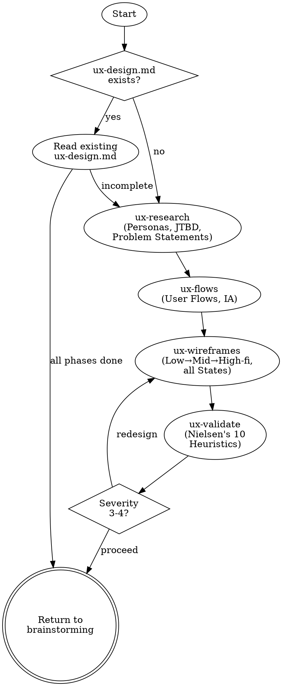

# UX Design

Orchestrates the full UX design process through 4 phase skills. Each phase produces a section in `ux-design.md` and can be invoked independently.

**Announce at start:** "I'm running the UX design process — checking which phases are needed."

## When to Use

- When building user-facing features that need UI design
- When the user asks about user flows, screen layouts, navigation, or interaction design
- After brainstorming has clarified requirements and before feature-design writes BDD scenarios

**When NOT to use:**
- For API-only services with no user interface
- For pure backend/infrastructure work

## Process

## Phase Skills

| Phase | Skill | Produces (in ux-design.md) | Consumed by |
|---|---|---|---|
| 1. Research & Define | `superflowers:ux-research` | Personas, JTBD, Problem Statements | feature-design |
| 2. Ideate | `superflowers:ux-flows` | User Flows, Information Architecture | feature-design, writing-plans |
| 3. Design | `superflowers:ux-wireframes` | Wireframes, State Designs, Design Decisions | writing-plans, feature-design |
| 4. Validate | `superflowers:ux-validate` | Heuristic Evaluation | Redesign loop, quality-scenarios |

## Orchestration Logic

1. Check if `ux-design.md` exists
2. If yes: read it, determine which sections are filled → skip completed phases
3. Invoke the next incomplete phase skill
4. After each phase: check if user wants to continue or pause
5. After ux-validate: if Severity 3-4 findings → invoke ux-wireframes again
