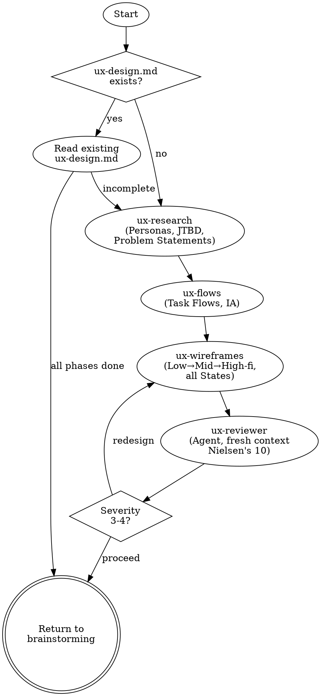

**Semantic anchors:** Design Thinking Double Diamond, UX orchestration (Research → Flows → Wireframes → Validation), Nielsen's 10 Usability Heuristics.

# UX Design

Orchestrates the full UX design process through 4 phase skills. Each phase produces a section in `ux-design.md` and can be invoked independently.

**Announce at start:** "I'm running the UX design process — checking which phases are needed."

## When to Use

- When building user-facing features that need UI design
- When the user asks about task flows, screen layouts, navigation, or interaction design
- After brainstorming has clarified requirements and before feature-design writes BDD scenarios

**When NOT to use:**
- For API-only services with no user interface
- For pure backend/infrastructure work

## Process



## Phase Skills

| Phase | Skill / Agent | Produces (in ux-design.md) | Consumed by |
|---|---|---|---|
| 1. Research & Define | `superflowers:ux-research` | Personas, JTBD, Problem Statements | feature-design |
| 2. Ideate | `superflowers:ux-flows` | Task Flows, Information Architecture | feature-design, writing-plans |
| 3. Design | `superflowers:ux-wireframes` | Wireframes, State Designs, Design Decisions | writing-plans, feature-design |
| 4. Validate | `ux-reviewer` (Agent, fresh context) | Heuristic Evaluation (Nielsen's 10) | Redesign loop back to ux-wireframes |

## Orchestration Logic

1. Check if `ux-design.md` exists
2. If yes: read it, determine which sections are filled → skip completed phases
3. Invoke the next incomplete phase skill
4. After each phase: check if user wants to continue or pause
5. ux-wireframes dispatches ux-reviewer agent automatically — if Severity 3-4 findings, loop back to ux-wireframes

## The Iron Law

```
NO UI IMPLEMENTATION WITHOUT COMPLETING THE UX DESIGN PHASES
```

Research → Flows → Wireframes → Validation. Skip a phase, pay in rework.

<HARD-GATE>
Do NOT proceed to writing-plans or implementation until:
1. Personas and HMW questions exist (ux-research)
2. Task flows are mapped for priority scenarios (ux-flows)
3. Wireframes are designed with all states (ux-wireframes)
4. Usability validation passed (ux-reviewer agent returned APPROVED)
</HARD-GATE>

## Red Flags — STOP

- Jumping to wireframes without personas or flows
- "We know what the UI should look like" without evidence
- Skipping ux-reviewer validation ("wireframes look fine")
- Designing all screens at once instead of priority-first
- Running all three phases in one message instead of step-by-step dialog

## Rationalization Prevention

| Excuse | Reality |
|--------|---------|
| "The UI is simple, we don't need UX research" | Simple UIs still have users with goals and frustrations. |
| "We can do UX later" | UX after implementation means redesign, not refinement. |
| "We already have a design spec" | A spec is input to ux-research, not a replacement for it. |
| "We only have one screen" | One screen with 5 states is 5 designs. Research and flows still apply. |

## The Bottom Line

UX design before UI implementation. Research → Flows → Wireframes — skip a phase, pay later.
