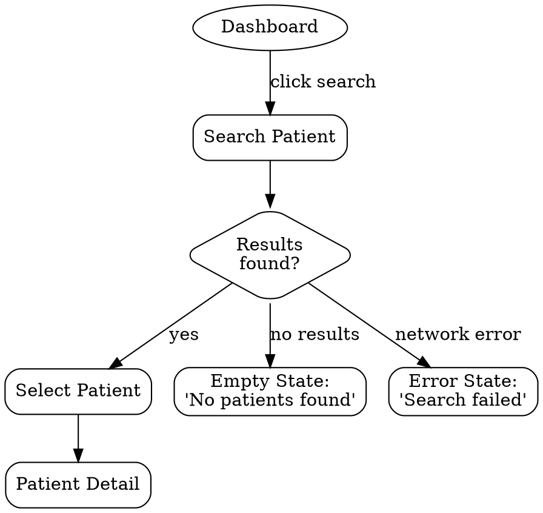

# UX Flows & Information Architecture

Map how users move through the system. For each core scenario, create a user flow with happy path, branches, error states, and exit points. Second phase of the UX design process.

**Semantic anchors:** User Flows (NNG Page Laubheimer), Task Flows, Wire Flows, Information Architecture, Navigation Design, Ryan Singer "Shorthand for Designing UI Flows".

**Announce at start:** "I'm designing user flows — mapping how each persona moves through the system."

## When to Use

- After `superflowers:ux-research` has produced personas and scenarios
- When navigation or interaction paths need to be designed
- When the user asks "how should the user get from A to B?"

**When NOT to use:**
- If `ux-design.md` doesn't have Personas yet — run `ux-research` first
- If user flows already exist and are current

## Step 1: User Flows

For each Core scenario from ux-research, create a flow:

1. **Define entry points** — How does the user arrive? (login, dashboard, notification, direct URL)
2. **Map the happy path** — Simplest successful completion
3. **Add decision branches** — Validation fails? Not logged in? No data?
4. **Add error states** — Network failure, permission denied, timeout
5. **Add exit points** — Where can the user abandon? What happens?

Use DOT notation:


Render flows in the Visual Companion for the user to review.

**Key rule:** Every flow path (happy, error, edge case) becomes at least one BDD scenario in `feature-design`. Design flows with this in mind.

## Step 2: Information Architecture

Define the navigation structure:
- **Primary navigation** — always visible (main menu items)
- **Secondary navigation** — context-dependent (within a section)
- **Content hierarchy** per screen — what's most important?

**Uncertainty handling:** If a feature could live in two navigation locations, follow `references/uncertainty-handling.md`: present options with tradeoffs.

## Write to ux-design.md

Append the following sections:

```markdown
## User Flows

> Consumed by: `superflowers:feature-design` (jeder Flow-Pfad = BDD Scenario)

### Flow: [Task Name]
[DOT Diagramm]
- Entry Points: ...
- Happy Path: ...
- Error Branches: ...
- Exit Points: ...

## Information Architecture

> Consumed by: `superflowers:writing-plans` (Frontend-Task-Struktur)

- Primary Navigation: ...
- Screen Hierarchy: ...
```
