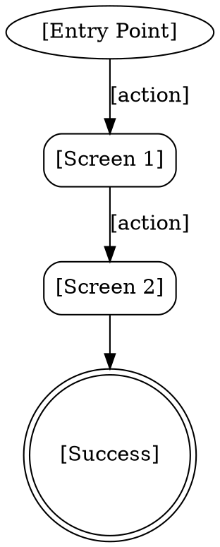

# UX Flows & Information Architecture

Map how users move through the system. **Work through flows one at a time with the user — don't generate all flows at once.**

**Semantic anchors:** User Flows (NNG Page Laubheimer), Task Flows, Wire Flows, Information Architecture, Navigation Design.

**Announce at start:** "Let's map out how your users move through the system — one flow at a time."

## When to Use

- After `superflowers:ux-research` has produced personas and scenarios
- When navigation or interaction paths need to be designed

**When NOT to use:**
- If `ux-design.md` doesn't have Personas yet — run `ux-research` first

## The Dialog Process

### Turn 1: Pick the First Flow

Read the prioritized scenarios from `ux-design.md`. Ask:

> "Der wichtigste Ablauf ist '[top scenario]'. Sollen wir damit anfangen, oder gibt es einen anderen Flow der dir wichtiger ist?"

Wait for user's choice.

### Turn 2: Entry Points

Ask:

> "Wie kommt [Persona] zu diesem Feature? Über das Hauptmenü, eine Suche, eine Benachrichtigung, oder einen Direktlink?"

Wait. This determines the flow's starting point(s).

### Turn 3: Happy Path

Draft the simplest successful path based on the scenario. Render as DOT diagram in Visual Companion (if available) or describe as numbered steps.



Ask: "Stimmt dieser Ablauf? Fehlt ein Schritt, oder würde [Persona] es anders machen?"

Wait. Incorporate feedback.

### Turn 4: Error & Edge Cases

Ask:

> "Was kann schiefgehen? Z.B.: Was passiert wenn [Persona] nicht eingeloggt ist? Wenn keine Daten gefunden werden? Wenn das Netzwerk abbricht?"

Wait. Add error branches to the flow based on user's answers. Present updated flow.

### Turn 5: Exit Points

Ask:

> "Wo könnte [Persona] abbrechen — und was soll dann passieren? Daten verloren oder gespeichert?"

Complete the flow. Present final version.

> "Ist dieser Flow komplett? Dann zum nächsten — oder reicht es für jetzt?"

### Repeat for Next Flows

For each additional flow, repeat Turns 2-5. After each completed flow:

> "Sollen wir den nächsten Flow ([next scenario]) angehen, oder reichen die bisherigen?"

### Information Architecture

After the important flows are mapped, ask:

> "Welche Hauptbereiche soll die Navigation haben? Was soll immer sichtbar sein?"

Draft IA based on the flows and user input. Present and refine.

## Write to ux-design.md

After user confirmation per flow, append:

```markdown
## User Flows

> Consumed by: `superflowers:feature-design` (jeder Flow-Pfad = BDD Scenario)

### Flow: [Task Name]
[DOT Diagramm]
- Entry Points: ...
- Happy Path: ...
- Error Branches: ...
- Exit Points: ...

## Information Architecture

> Consumed by: `superflowers:writing-plans` (Frontend-Task-Struktur)

- Primary Navigation: ...
- Screen Hierarchy: ...
```
