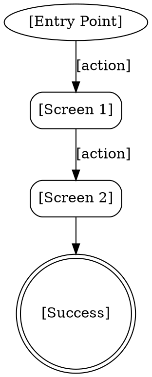

# UX Flows & Information Architecture

Map how users move through the system. **Work through flows one at a time with the user — don't generate all flows at once.**

**Semantic anchors:** Task Flows (NNG Page Laubheimer), Wire Flows, Information Architecture, Navigation Design.

**Announce at start:** "Let's map out how your users move through the system — one flow at a time."

## When to Use

- After `superflowers:ux-research` has produced personas and scenarios
- When navigation or interaction paths need to be designed

**When NOT to use:**
- If `ux-design.md` doesn't have Personas yet — run `ux-research` first

## The Dialog Process

### Turn 1: Pick the First Flow

Read the prioritized scenarios from `ux-design.md`. Ask:

> "Der wichtigste Ablauf ist '[top scenario]'. Sollen wir damit anfangen, oder gibt es einen anderen Flow der dir wichtiger ist?"

Wait for user's choice.

### Turn 2: Propose Flow Structure Options

Read the scenario, personas, and JTBD from `ux-design.md`. Analyze the task complexity (number of steps, decision points, data entry requirements). Then follow `references/proactive-analysis.md`:

> "For '[scenario]', I see [N] steps and [M] decision points. Here are different ways to structure this flow:"
>
> **Option A (recommended): [Pattern name, e.g., Linear Wizard]** — [one sentence].
> Entry: [how user gets here]. Steps flow [description].
> Best when: [condition, e.g., first-time users, complex forms].
> Trade-off: [e.g., rigid, no jumping ahead].
>
> **Option B: [Pattern name, e.g., Hub-and-Spoke]** — [one sentence].
> Entry: [how user gets here]. User starts at [hub], branches to [spokes].
> Best when: [condition, e.g., expert users, non-linear tasks].
> Trade-off: [e.g., more cognitive load, user needs to know what they want].
>
> **Option C: [Pattern name, e.g., Progressive Disclosure]** — [one sentence].
> Entry: [how user gets here]. Shows [minimal first], reveals [more on demand].
> Best when: [condition, e.g., mixed audiences, optional complexity].
> Trade-off: [e.g., advanced features hidden, discoverability suffers].
>
> "Which structure fits [Persona]'s workflow best?"

Wait for user's choice.

### Turn 3: Happy Path for Chosen Structure

Draft the happy path using the structure chosen in Turn 2. Include the entry point from the chosen option. Render as DOT diagram in Visual Companion (if available) or describe as numbered steps.



Ask: "Stimmt dieser Ablauf? Fehlt ein Schritt, oder würde [Persona] es anders machen?"

Wait. Incorporate feedback.

### Turn 4: Error & Edge Cases

Ask:

> "Was kann schiefgehen? Z.B.: Was passiert wenn [Persona] nicht eingeloggt ist? Wenn keine Daten gefunden werden? Wenn das Netzwerk abbricht?"

Wait. Add error branches to the flow based on user's answers. Present updated flow.

### Turn 5: Exit Points

Ask:

> "Wo könnte [Persona] abbrechen — und was soll dann passieren? Daten verloren oder gespeichert?"

Complete the flow. Present final version.

> "Ist dieser Flow komplett? Dann zum nächsten — oder reicht es für jetzt?"

### Repeat for Next Flows

For each additional flow, repeat Turns 2-5. After each completed flow:

> "Sollen wir den nächsten Flow ([next scenario]) angehen, oder reichen die bisherigen?"

### Information Architecture

After the important flows are mapped, ask:

> "Welche Hauptbereiche soll die Navigation haben? Was soll immer sichtbar sein?"

Draft IA based on the flows and user input. Present and refine.

## Reference Files

- `references/proactive-analysis.md` — The "analyze first, propose options" meta-pattern

## Write to ux-design.md

After user confirmation per flow, append:

```markdown
## Task Flows

> Consumed by: `superflowers:feature-design` (jeder Flow-Pfad = BDD Scenario)

### Flow: [Task Name]
[DOT Diagramm]
- Entry Points: ...
- Happy Path: ...
- Error Branches: ...
- Exit Points: ...

## Information Architecture

> Consumed by: `superflowers:writing-plans` (Frontend-Task-Struktur)

- Primary Navigation: ...
- Screen Hierarchy: ...
```

## Red Flags — STOP

- Flows without persona reference ("the user clicks..." — which user? Which goal?)
- Happy path only — no error branches, no edge cases
- Linear flow for a non-linear task (forcing wizard when hub-and-spoke fits better)
- Flow steps that describe system behavior instead of user actions ("system validates input" → "user sees validation error")
- Skipping Information Architecture ("we'll figure out navigation later")

## Rationalization Prevention

| Excuse | Reality |
|--------|---------|
| "The happy path is enough for now" | Error cases determine UI complexity. Discover them now or redesign later. |
| "Navigation is obvious" | Obvious to you. Test it with the persona's mental model, not yours. |
| "We don't need a diagram" | Diagrams expose missing steps. Text descriptions hide them. |
| "Edge cases are rare" | Rare cases are where users get stuck. Those are the flows that need the most design. |
| "We can add error handling later" | Error flows change the happy path. They're not additive — they're structural. |

## Verification Checklist

- [ ] Each task flow references a specific persona and scenario
- [ ] Happy path is complete (entry point → success state)
- [ ] Error branches are mapped (at least 2 per flow)
- [ ] Exit points are defined (what happens on abort?)
- [ ] Flow rendered as DOT diagram or numbered steps
- [ ] User has confirmed each flow before moving to next
- [ ] Output written to ux-design.md in correct format

## The Bottom Line

Task flows describe what users DO, not what the system shows. If the flow has no decision points, it's a feature list.
